# 引言

- 1949	香农	《保密系统的通信理论》	为密码学奠定了理论基础
- 1976	W.Diffie 和 M.E.Hellman	《密码学中的新方向》	首次证明从发送端到接收端的保密通信是可能的，开创**公钥密码学**的新纪元

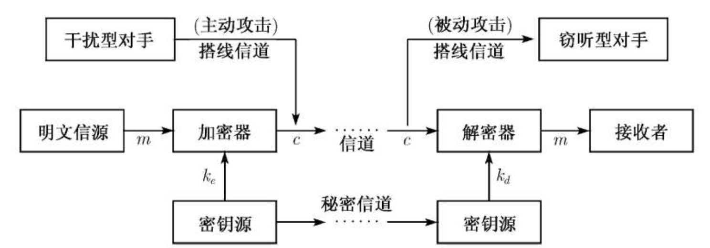

- 窃听型对手：截取信道上传送的信息进行分析
- 干扰型对手：篡改信道上传送的信息

## 密码体制

- 明文空间 M
- 密文空间 C
- 密钥空间 K：每个密钥 k 由加密密钥 k~e~ 和解密密钥 k~d~ 组成
- 加密算法 ε
- 解密算法 D

**密钥量**：密钥空间中不同密钥的个数

**公钥密码体制**：在一个双密钥密码体制中，由加密密钥 k~e~ 计算解密密钥 k~d~ 是困难的，公开 k~e~ 不会损害 k~d~ 的安全性，则可以将加密密钥 k~e~ 公开

## 密码分析

根据已掌握的信息推断出明文或密钥

# 密码攻击类型

- 唯密文攻击：仅知道一些密文
- 已知密文攻击：知道一些明文和相应的密文
- 选择密文攻击：选择一些密文并得到相应明文
- 选择明文攻击：选择一些明文并得到相应密文

## 密码体制的安全性

- 计算安全性：使用最好的算法来破译一个密码体制至少需要 n 次操作，而 n 是一个非常大的数
- 可证明安全性：一个密码体制的安全性可以归结为某个难解的数学问题
- 无条件安全性：即使密码分析者有无限的计算能力也无法破译该密码体制

# 古典密码

## 基本加密运算

- **单表密码体制**：明文字母所对应的密文字母在密文中保持不变
- **多表密码体制**：明文中不同位置的同一明文字母在密文中对应的密文字母不同。多表密码体制隐藏了统计特性

### 单表古典密码

#### 加法密码

$$
c = E_{k}(m) = (m + k)\;mod\;q
$$

密钥量为 **q**

#### 乘法密码 ####

$$
c = E_{k}(m) = km\;mod\;q
$$

密钥量为 **φ(q)**

#### 仿射密码

$$
c = E_{k}(m) = (k_1 + k_2m)\;mod\;q;
$$

密钥量为 **qφ(q)**

#### 置换密码

$$
c = E_k(m) = σ(m)
$$

密钥量为 **q!**

### 多表古典密码

#### 简单加法密码

$$
c = E_{k}(m) = (m_1 + k_1, m_2 + k_2,...,m_n+k_n)\;mod\;q
$$

密钥量为 **q^n^**

#### 简单乘法密码

$$
c = E_{k}(m) = (k_1m_1, k_2m_2,...,k_nm_n)\;mod\;q
$$

密钥量为 **φ(q)^n^**

#### 简单仿射密码

密钥量为 **q^n^φ(q)^n^**

#### 简单置换密码

密钥量为 **(q!)^n^**

#### 换位密码

密钥量为 **n!**

## 典型古典密码体制

### 典型单表古典密码体制

Caesar 体制

标准字头密码体制：选择一个密钥字

### 典型多表古典密码体制

#### Playfair 体制

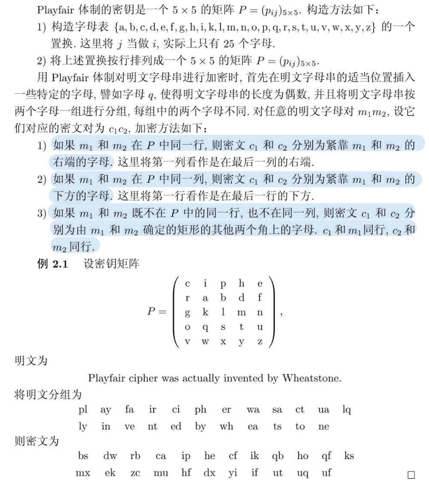

#### Vigenere 体制

设明文 $m = m_1m_2...m_n$，密钥 $k = k_1k_2...k_n$，则密文 $c = E_k(m) = c_1c_2...c_n$，其中 **$c_i = (m_i + k_i)\;mod\;26, i = 1, 2,..., n$**。

当密钥长度比明文短时，密钥可以周期性地重复使用。

当用密钥字母 k~i~ 对明文字母 m~i~ 进行加密时，Vigenere 方阵中的第 k~i~ 行第 m~i~ 列的字母就是相应的密文字母。

#### Beaufort 体制

设明文 $m = m_1m_2...m_n$，密钥 $k = k_1k_2...k_n$，则密文 $c = E_k(m) = c_1c_2...c_n$，其中 **$c_i = (k_i + 25 - m_i)\;mod\;26, i = 1, 2,..., n$**。

当密钥长度比明文短时，密钥可以周期性地重复使用。

当用密钥字母 k~i~ 对明文字母 m~i~ 进行加密时，Beaufort 方阵中的第 k~i~ 行第 m~i~ 列的字母就是相应的密文字母。

#### Vernam 体制

设明文 $m = m_1m_2...m_i...$，密钥 $k = k_1k_2...k_i...$，其中 $m_i, k_i∈GF(2), \;i ≥ 1$，则密文 $c = E_k(m) = c_1c_2...c_i...$，其中 **$c_i = m_i ⊕ k_i, \;i ≥ 1$**。

一次一密，理论上不可破译，有**完善保密性**

$k_i = m_i ⊕ c_i, \;i ≥ 1$，如果密钥 k 重复使用，容易被破译

#### Hill 体制

设明文 $m = m_1m_2...m_n$，密文 $c = E_k(m) = c_1c_2...c_n$，密钥为 $n × n$ 阶可逆方阵$K = (k_{ij})_{n×n}$，则
$$
c = Km\;mod\;26,\ m为列向量\\
m = K^{-1}c\;mod\;26.
$$
二阶矩阵 A 逆矩阵
$$
A^{-1}=\frac{A^*}{|A|}\\
二阶A^*：主对调副变号
$$

 ## 古典密码的统计分析

### 多表古典密码的统计分析

**Kasiski 测试法**：寻找密文中长度至少为 3 的相同的密文片段对，计算每对密文片段中的两个密文片段之间的距离，记为 d~1~, d~2~, d~3~, ... , d~i~，猜测密钥字的长度 m 可能是 d~1~, d~2~, d~3~, ... , d~i~ 的最大公因子。

**重合指数 $I_c(x)$：**设 $x = x_1x_2...x_n$ 是一个长度为 n 的英文字母串。$x$ 的重合指数定义为 $x$ 中的随机两个元素相同的概率。假设 A, B, C, ... , Z 在 $x$ 中的出现次数分别为 $f_0, f_1, f_2, ... , f_{25}$，则从 $x$ 中选取两个元素共有 $C_n^2$ 种方法，选取两个元素同时为第 i 个英文字母的情形共有 $C_{f_i}^2$ 种。因此
$$
I_c(x) = \frac{\sum_{i=0}^{25}f_i(f_i-1) }{n(n-1)}\approx \sum_{i=0}^{25}p_i^2
$$
**0.065	0.038**

# Shannon 理论

## 熵及其性质

### 熵

随机变量 X 的**熵**
$$
H(X) = -\sum_{i=1}^{n}Pr(x_i)log_2Pr(x_i)
$$
随机变量 X 和 Y 的**联合熵**
$$
H(X,Y) = -\sum_{i=1}^{n}\sum_{j=1}^{m}Pr(x_i, y_j)log_2Pr(x_i, y_j)
$$
X 在 Y 取值 $y_j$ 时的**条件熵**
$$
H(X|y_j) = -\sum_{i=1}^{n}Pr(x_i|y_j)log_2Pr(x_i|y_j)
$$
X 关于 Y 的**条件熵**
$$
H(X|Y) = \sum_{j=1}^{m}Pr(y_j)H(X|y_j)
\\ = -\sum_{j=1}^{m}\sum_{i=1}^{n}Pr(y_j)Pr(x_i|y_j)log_2Pr(x_i|y_j) 
\\ = -\sum_{j=1}^{m}\sum_{i=1}^{n}Pr(x_i, y_j)log_2Pr(x_i|y_j)
$$

### 性质

$$
0 \le H(X) \le log_2n
$$

$H(x) = 0$ 当且仅当存在一个 $1 \le i \le n$，有 $Pr(x_i) = 1$，而对其他 $j \ne i$，有 $Pr(x_i) = 0, 1 \le j \le n$。

$H(x) = log_2n$ 当且仅当任意 $1 \le i \le n$，都有$Pr(x_i) = \frac{1}{n}$。


$$
H(X,Y) \le H(X)+H(Y)
$$
等号成立当且仅当 X 与 Y 相互独立。


$$
H(X,Y)=H(Y)+H(X|Y)=H(X)+H(Y|X)
$$

$$
H(X|Y) \le H(X)
$$
等号成立当且仅当 X 与 Y 相互独立。

## 伪密钥和唯一解距离

$$
H(K|C)=H(K)+H(M)-H(C)
$$

设 L 是一个自然语言。$H_L = \lim_{n \to \infty} \frac{H(X^{(n)})}{n}$ 称为**语言 L 的熵**。$R_L = 1-\frac{H_L}{log_2|X|}$称为语言 L 的**冗余度**。

对于字母表上的一个随机语言 L，$H_L = log_2|X|$。自然语言的冗余度是“多余字母”的度量。

当 n 充分大时，伪密钥的期望数目满足
$$
\bar{s_n} \ge \frac{|K|} {|X|^{nR_L}} - 1
$$
**唯一解距离/唯一解码量：**

- 将密钥唯一确定所平均需要的最少的密文的数量。
- 使得伪密钥的期望数目$\bar{s_n}$等于 0 的密文长度 n， 记为 n~0~。

明文语言的冗余度越大，唯一解距离就越小，密码分析者在唯密文攻击的情况下越容易求得正确的密钥。

## 密码体制的完善保密性

**完善保密性：**对任意 $x\in M$ 和任意 $y \in C$，都有 $Pr(x|y) = Pr(X)$。

## 乘积密码体制

$$
E_k(x) = E_{k_2}(E_{k_1(x)})\\
D_k(y) = D_{k_1}(D_{k_2(y)})
$$

# 分组密码

利用分组密码对明文加密时 ，要先对明文进行分组，每组长度相同，然后对每组明文分别加密得到等长的密文。分组密码的特点是**加密密钥和解密密钥相同**。

## 分组密码的基本原理

**扩散和混淆**是设计密码体制的两种基本方法。

- 扩散：让明文中的每一位影响密文中的许多位。可以隐蔽明文的统计特性
- 混淆：将密文与密钥之间的统计关系变得复杂。使对手即使获得统计特性也无法推测密钥

## 分组密码的结构

分组密码体制基本都是基于**乘积和迭代**来构造。乘积通常由一系列**置换和代换**所构成。

两种常见的分组密码结构是 Feistel 网络和 SP 网络。DES 和 AES 分别是 Feistel 网络和 SP 网络的典型例子。

### Feistel 网络

#### 平衡的 Feistel 网络

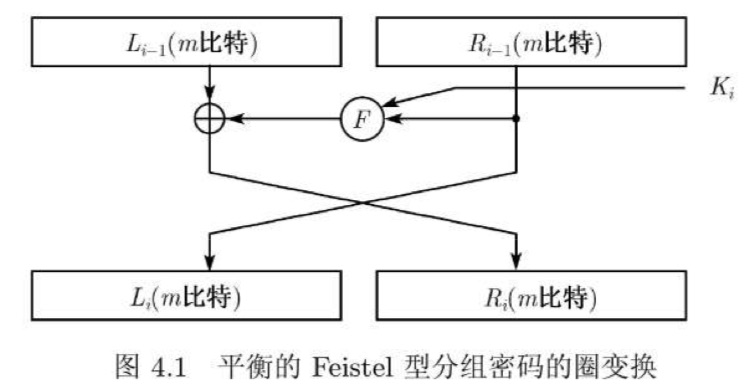

将明文左右等分
$$
\begin{cases}
L_i = R_{i-1},\\
R_i = L_{i-1}\oplus F(R_{i-1}, K_i)
\end{cases}
$$
密文为 $y = R_rL_r$

#### 非平衡的 Feistel网络

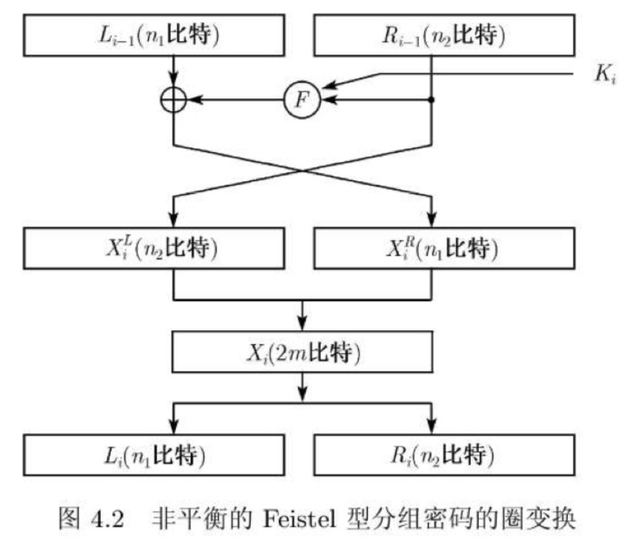

设明文 x 长度为 2m 比特，$x = L_0R_0$，L~0~ 是左边的 n~1~ 比特，R~0~ 是右边的 n~2~ 比特，$n_1+n_2 = 2m$。
$$
\begin{cases}
X_i^L = R_{i-1},\\
X_i^R = L_{i-1}\oplus F(R_{i-1}, K_i),\\
X_i = X_i^LX_i^R
\end{cases}
$$
密文为 $y = X_r^RX_r^L$

在 Feisel 型分组密码的加密过程最后一轮没有进行左右交换，目的是为了可以利用同一个算法进行加解密。

### SP 网络

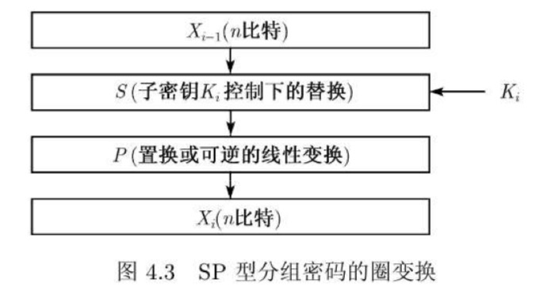

替换 S 一般被称为混淆层，置换或可逆的线性变换 P 一般被称为扩散层。

SP 型分组密码一般不能用同一个算法加解密。

## 数据加密标准 DES

分组长度为 64 比特，密钥长度也为 64 比特。密钥中有 8 比特的奇偶校验位，实际密钥长度为 56 比特。

### DES 加密算法

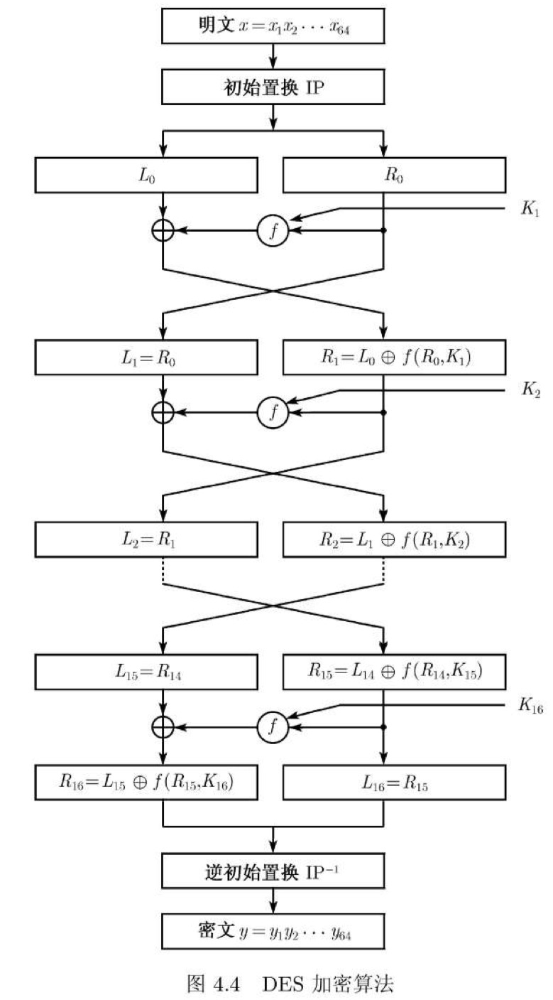

初始置换 IP 用于对明文 x 中的各位进行换位。经过初始置换后，x 变为 $x'=x_1'x_2'...x_{64}' = x_{58}x_{50}...x_7$。

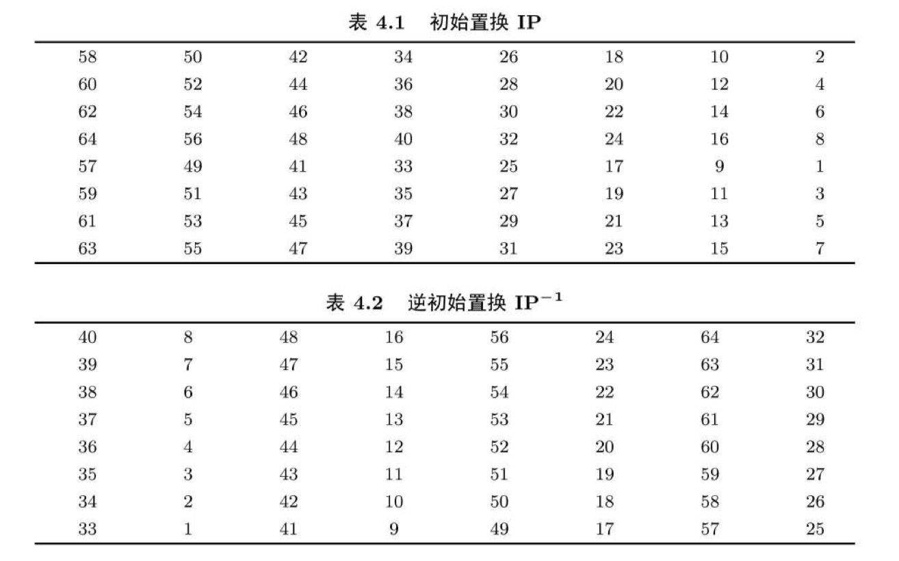 
$$
\begin{cases}
L_i = R_{i-1},\\
R_i = L_{i-1}\oplus F(R_{i-1}, K_i),\\
i = 1, 2, ... , 15, 16
\end{cases}
$$
$L_i$ 和 $R_i$ 都是 32 比特，$K_i$ 是由密钥 k 产生的 48 比特的子密钥。

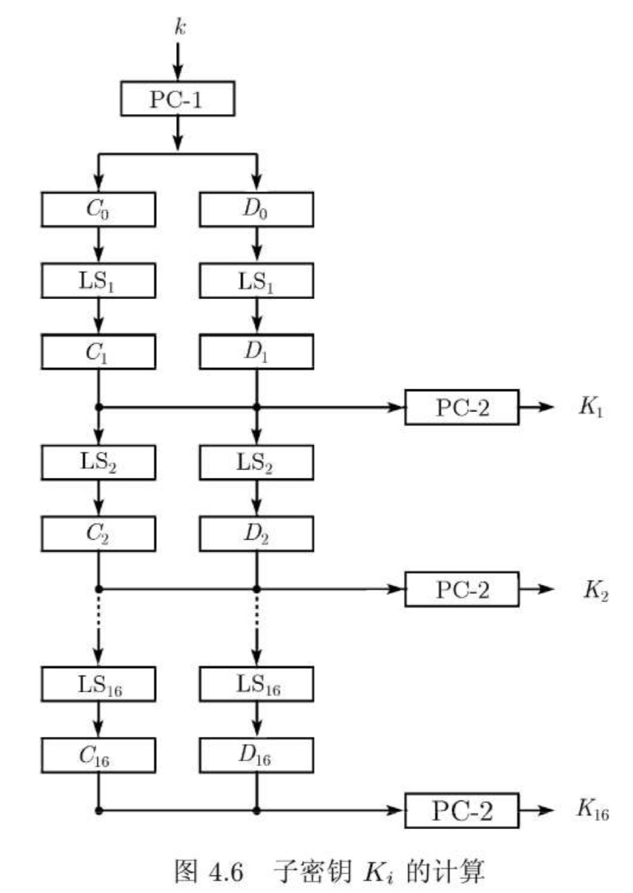

选择置换 PC-1 用于去掉密钥 k 中的 8 个奇偶校验位，并对其余的 56 位进行打乱。将 PC-1 输出中的前 28 位作为 C~0~，后 28 位作为 D~0~，
$$
\begin{cases}
C_i = LS_{i}(C_{i-1}),\\
D_i = LS_{i}(D_{i-1})
\end{cases}
$$
$LS_i$ 表示对 $C_{i-1}$ 和 $D_{i-1}$ 进行循环左移变换。$LS_1, LS_2, LS_9, LS_{16}$ 是循环左移 1 位变换，其余是循环左移 2 位变换。

选择置换 PC-2 用于从 $C_iD_i$ 中选取 48 位作为子密钥 $K_i$。

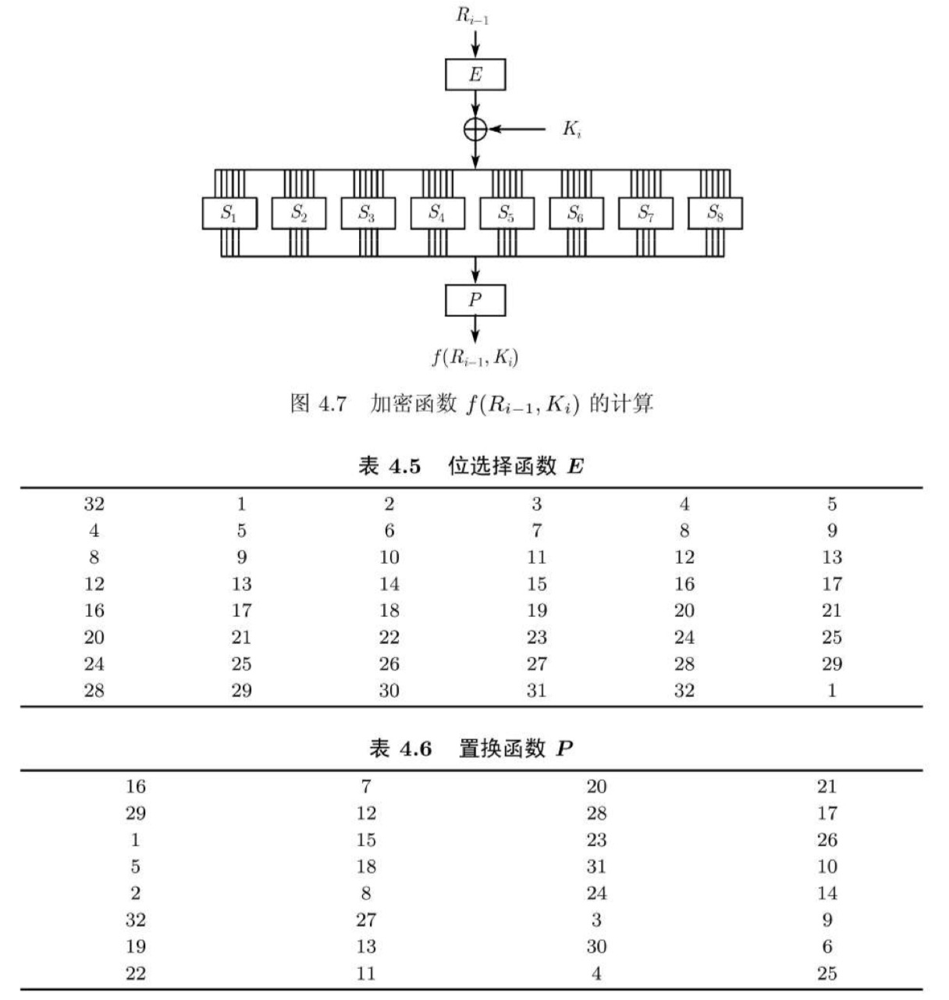

> [!NOTE]
>
> E 扩展（32 → 48）➡️ 异或（48 → 48）➡️ S 盒（48 → 32）➡️ P 置换（32 → 32）

1. E 扩展置换用于将 32 比特的输入扩展为 48 比特（分 8 组 4 比特，填充每组左右）

2. 扩展结果与子密钥进行异或

3. S 盒压缩将 48 比特的输入压缩为 32 比特（分 8 组 6 比特，头尾做行，中间做列，对照 S 盒表）

4. 对照 P 盒进行置换

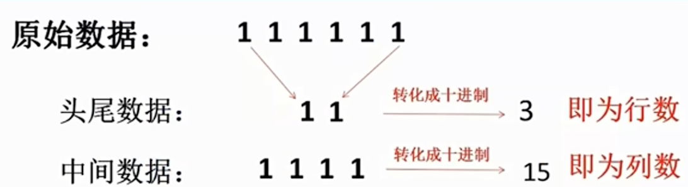

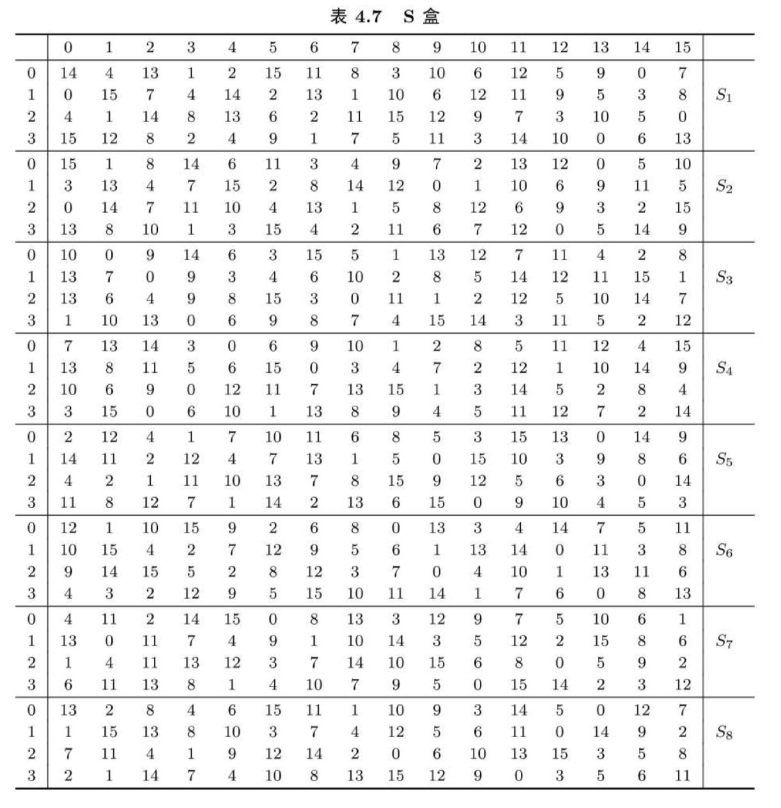

### DES 的解密过程

DES 的加解密过程使用同一算法，但在 16 次迭代中使用子密钥的次序相反。
$$
\begin{cases}
R_{i-1} = L_i,\\
L_{i-1} = R_{i}\oplus f(L_{i}, K_i),\\
i = 16, 15, ... , 2, 1
\end{cases}
$$

### DES 的安全性

S 盒是关键

密钥量少，无法抵抗对密钥的穷举搜索攻击

## 多重 DES

### 双重 DES

$$
y = DES_{k_2}(DES_{k_1}(x))\\
x = DES_{k_1}^{-1}(DES_{k_2}^{-1}(y))
$$

**中途相遇攻击**：加密一半解密一半，若结果一致则有可能是找到$k_1, k_2$ （$DES_{k_1}(x) = DES_{k_2}^{-1}(y)$）

### 三重 DES

$$
y = DES_{k_3}(DES_{k_2}^{-1}(DES_{k_1}(x)))\\
x = DES_{k_1}^{-1}(DES_{k_2}(DES_{k_3}^{-1}(y)))
$$

中间采用解密是为了可以利用三重 DES 对单重 DES 加密的数据进行解密

## 高级加密标准 AES

### AES 的数学基础

#### 字节运算

$$
xtime(a)=(a≪1)⊕(0x1B\; if 最高位为1)
$$

比如：`a = 0x57`（即二进制 0101 0111）

```text
a << 1 = 1010 1110 = 0xAE
a 的最高位是 0 → 不需要模约简
所以 xtime(0x57) = 0xAE
```

再比如：`a = 0x83`（1000 0011）

```
a << 1 = 0000 0110（溢出部分被丢弃）= 0x06
a 的最高位是 1 → 需要模约简
所以 xtime(0x83) = 0x06 ^ 0x1B = 0x1D
```

 

### AES 加密过程

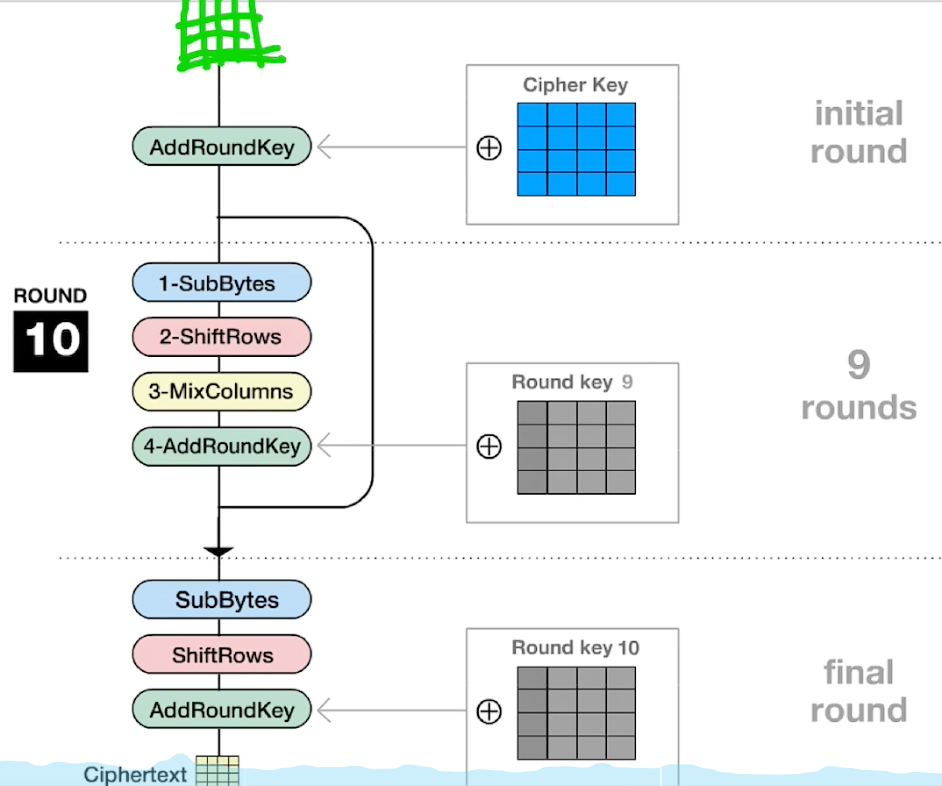

1. 初始变换：与初始密钥进行异或

2. 9 轮循环运算

   1. 字节代换 SubBytes：对照 S 盒进行代换。

   2. 行移位 ShiftRows：对一个状态的每一行循环左移，第 0 行不变，第 1 行循环左移 1 个字节，第 2 行循环左移 2个字节，第 3 行循环左移 3 个字节。

   3. 列混合 MixColumns：进行矩阵乘法
      $$
      \begin{pmatrix}
      s_{0j}' \\ s_{1j}' \\ s_{2j}' \\ s_{3j}'
      \end{pmatrix}
      = \begin{pmatrix}
       02 & 03 & 01 & 01\\
       01 & 02 & 03 & 01\\
       01 & 01 & 02 & 03\\
       03 & 01 & 01 & 02
      \end{pmatrix} 
      \begin{pmatrix}
      s_{0j} \\ s_{1j} \\ s_{2j} \\ s_{3j}
      \end{pmatrix}
      , 0 \le j \le 3
      $$

   4. 轮密钥加 AddRoundKey：将一个轮密钥按位异或到一个状态上。轮密钥按顺序取自扩展密钥。扩展密钥是由原始密钥经过扩展得到的。

      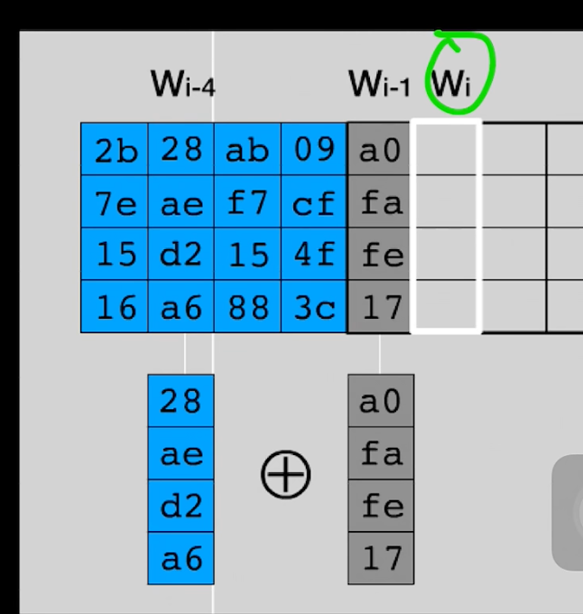

       - W~0~ 到 W~3~ 是初始密钥

       - 如果 i 不是 4 的倍数，$W[i] = W[i-4] \oplus W[i-1]$

       - 如果 i 是 4 的倍数，$W[i] = W[i-4] \oplus T(W[i-1])$。T 函数由三部分组成

         1. 字循环：将 1 个字中的 4 个字节循环左移 1 个字节

         2. 字节代换：对字循环的结果使用 S 盒进行字节代换

         3. 轮常量异或：将前两步的结果同轮常量 Rcon[j] 进行异或，j 表示轮数

3. 1 轮最终轮
   1. 字节代换
   2. 行移位
   3. 轮密钥加

## 分组密码的工作模式

### 电子密码本模式（ECB）

$$
y_i = E_k(x_i), \;1 \le i \le m\\
x_i = D_k(y_i), \;1 \le i \le m
$$

一个密文块或明文块的改变，在解密或加密时只会引起相应的明文块或密文块改变。

优点：简单有效，可并行操作。

缺点：不同的明文分组之间的加密独立进行，故保留了单表代替缺点，造成相同明文分组对应相同密文分组，因而不能隐蔽明文分组的统计规律和结构规律，不能抵抗替换攻击。

### 密码分组链接模式（CBC）

$$
y_i = E_k(x_i \oplus y_{i-1}), \;1 \le i \le m\\
x_i = D_k(y_i) \oplus y_{i-1}, \;1 \le i \le m
$$

一个密文块 $y_i$ 的改变，在解密时只会引起相应的明文块 $x_i$ 和 $x_{i+1}$ 的改变；而一个明文块 $x_i$ 的改变，在加密时会引起相应的密文块 $y_i$ 以及其后所有密文块的改变。

特点

- 明文块的统计特性得到了隐蔽。
- 具有有限的(两步)错误传播特性。 一个密文块的错误将导致两个密文块不能正确解密。
- 具有自同步功能。密文出现丢块和错块不影响后续密文块的解密。若从第t 块起密文块正确，则第 t+1 个明文块就能正确求出。

优点：相同的明文块对应不同的密文块

应用：数据加密；完整性认证（用户检验收到的文件是否遭受第三方篡改）

### 密码反馈模式（CFB）

$$
z_i = E_k(y_{i-1}), \;1 \le i \le m\\
y_i = x_i \oplus z_i, \; 1 \le i \le m\\
x_i = y_i \oplus z_i, \;1 \le i \le m
$$

一个密文块 $y_i$ 的改变，在解密时只会引起相应的明文块 $x_i$ 和 $x_{i+1}$ 的改变；而一个明文块 $x_i$ 的改变，在加密时会引起相应的密文块 $y_i$ 以及其后所有密文块的改变。

优点

-  适用于每次处理 j比特明文块的特定需求的加密情形
- 具有有限步的错误传播，可用于认证
- 可实现自同步功能

缺点：加密效率低。

### 输出反馈模式（OFB）

$$
z_i = E_k(z_{i-1}), \;1 \le i \le m\\
y_i = x_i \oplus z_i, \; 1 \le i \le m\\
x_i = y_i \oplus z_i, \;1 \le i \le m
$$

一个密文块或明文块的改变，在解密或加密时只会引起相应的明文块或密文块改变。

优点

- 将分组密码当作序列密码使用的一种方式，但乱数与明文和密文无关
- 不具有错误传播特性
- 只要密文在传输过程中不丢信号，即使信道不好，也能将明文的大部分信号正常恢复

缺点

- 不能实现报文的完整性认证。
- 乱数序列的周期可能有短周期现象。

应用：图像加密，语音加密

### 计数器模式（CTR）

$$
z_i = E_k(T_i), \;1 \le i \le m\\
y_i = x_i \oplus z_i, \; 1 \le i \le m\\
x_i = y_i \oplus z_i, \;1 \le i \le m
$$

# 公钥密码

设 f 是一个函数，t 是与 f 有关的一个参数。如果当不知参数 t 时，计算 f 的逆函数是难解的，但知道参数 t 时，计算 f 的逆函数是容易的，则称 f 是一个**单向陷门函数**，参数 t 称为**陷门**。

## RSA 公钥密码

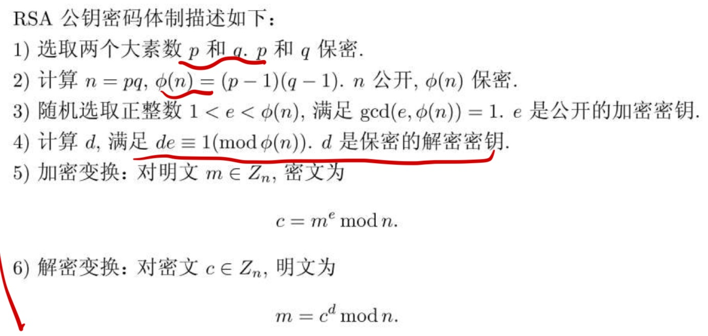

RSA 的安全性基于**分解大整数的困难性假定**

## 大素数的生成

存在无穷多个素数。

（素数定理）设 $x>0,π(x)$ 为不大于 x 的素数个数，则
$$
\lim_{x \to \infty} \frac{π(x)\ln{x}}{x} = 1
$$
素数的分布极不均匀，素数越大，分布越稀疏。

产生素数的过程

1. 产生一个 k 位的随机正整数 n。
2. 检查以确保 n 不能被任何小的素数整除。
3. 对 n 进行素性检测。

## EIGamal 公钥密码

ElGamal 算法是一种基于**离散对数难题**的**非对称加密算法**

ElGamal 加密算法的安全性依赖于：在大素数域 $Z_p^*$ 中的 **离散对数难题难以求解**。

1. 密钥生成：选择一个大素数 p，生成器 α，私钥 d，计算公钥 β：

   1. 选择一个大素数 p

   2. 选择一个本原元/生成元 α

      1. 分解 p - 1 为质因数乘积：$p-1 = q_1^{e_1} \cdot q_2^{e_2} \cdot \cdot \cdot q_n^{e_n}$

      2. 枚举 $α \in {2,3,...,p-2}$，判断是否满足 $α^{\frac{p-1}{q_i}} \not\equiv 1 \bmod p$，如果对所有 $q_i$ 都不成立，则 α 是本原元

         > 选 $p = 23$，那么：
         >
         > - $p −1=22=2⋅11$
         > - 检查 $α=5$是否为生成元：
         >   - $5^{22/2}=5^{11}\bmod  23=22≠1$
         >   - $5^{22/11}=5^{2} = 2\bmod  23=22≠1$
         >
         > 所以 $α=5$ 是生成元。

   3. 选取一个私钥 $d∈\{1,2,...,p−2\}$

   4. 计算公钥：$β=α^d\bmod p$

      - **公钥**：(p, α, β)

      - **私钥**：d

2. 加密

   1. 选取随机数 $k \in \{1,2,...,p-2\}$
   2. 计算 $c_1 = α^k \bmod p, \; c_2 = m \cdot β^k \bmod p$，密文为$(c_1, c_2)$

3. 解密

   1. 计算共享密钥 $s = c_1^d \bmod p$
   2. 计算逆元 $s^{-1} \bmod p$
   3. 恢复明文 $m = c_2 \cdot s^{-1} \bmod p$

> 选择：
>
> - $p=23, α=5$
> - 私钥 $d=6$
> - 公钥：$β=5^6 \bmod  23=8$
>
> 加密 $m=13$：
>
> - 选随机 $k=10$
> - $c_1=5^{10} \bmod  23=9$
> - $c_2=13⋅8^{10} \bmod  23=13⋅3 \bmod  23=16$
>
> 密文为 $(9,16)$
>
> 解密：
>
> - $s=9^{6} \bmod  23=3$
> - $s^{−1}=3^{−1} \bmod  23=8$
> - $m=16⋅8 \bmod  23=13$

# 序列密码与移位寄存器
## 移位寄存器与移位寄存器序列

移位寄存器是用来产生序列密码中的密钥序列的工具。

⼀个 q 元域 GF(q) 上的 n 阶反馈移位寄存器由 n 个寄存器和⼀个反馈函数构成。

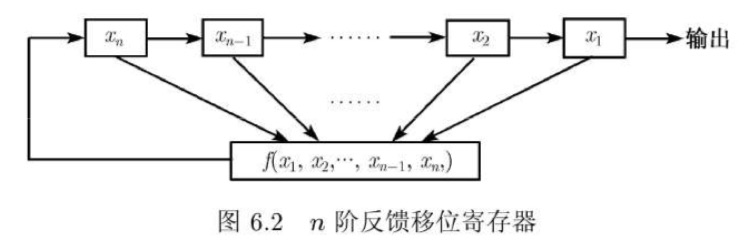

线性反馈移位寄存器反馈函数：$f(x_1,x_2,...,x_n) = c_nx_1+c_{n-1}x_2+...+c_1x_n$。系数不全为0。如果$c_n=0$，则称线性反馈移位寄存器是退化的。

## 线性移位寄存器的表示

设反馈函数为 $f(x_1,x_2,...,x_n) = -c_nx_1-c_{n-1}x_2-...-c_1x_n$，则**联系多项式**为 $g(x) = 1 + c_1x + c_2x^2 +...+ c_nx^n$，线性递推式为 $a_{t+n} = c_1a_{t+n-1}+c_2a_{t+n-2}+...+c_na_{t}$。

x 的下标与上标对应的寄存器相反

## 线性移位寄存器序列的周期性

序列 $a^\infty$ 的周期记为 $p(a^{\infty })$

一个 $GF(q)$ 上的 n 阶线性移位寄存器序列 $a^\infty $ 一定是周期序列，并且 $p(a^\infty ) \le q^n - 1$。

## 线性移位寄存器序列极⼩多项式

对于一个**有限域 GF(2)** 上的**周期性序列** $\{s_0,s_1,s_2,… $\}，它的极小多项式 m(x) 是**次数最低的非零多项式**，使得：$m(x)⋅S(x)=0$ 在 GF(2) 中。其中 $S(x)=s_0+s_1x+s_2x^2+… $是该序列的**生成函数**。

换句话说，极小多项式描述了一个最短长度的线性反馈关系：$s_n=c_1s_{n−1}+c_2s_{n−2}+⋯+c_Ls_{n−L} \bmod  2$

使得序列中每一项都可以由前面固定 L 项线性表示。

极小多项式对于给定序列是唯一的，阶是产生该序列所需的最小 LFSR 的长度

## m 序列的伪随机性

随机序列：分布特性、相关特性、游程特性

设 $a^\infty = (a_0a_1a_2...)$ 是 GF(2) 上的⼀个周期为 T 的序列。$R_{a^\infty }(τ) = \frac{1}{T} \sum_{i=0}^{T-1}(-1)^{a_i}(-1)^{a_{i+τ}}, 0 \le τ \le T-1$ 称为序列 $a_\infty$ 的⾃相关函数。

**自相关函数度量的是：序列和自身延迟 τ 后的相似性（符号乘积的平均值）**

设 $a^\infty = (a_0a_1a_2...)$ 是 GF(2) 上的⼀个 n 阶 m 序列, 则

- **在⼀个周期内，0 和 1 的出现次数分别为 $2^{n-1}-1$ 和 $2^{n-1}$**

- **在⼀个周期内，游程总数为 $2^{n-1}$；对任意的 $1 \le i \le n-2$，长为 i**
  **的 0 游程和 1 游程都有 $2^{n-i-2}$ 个；长为 n 的 0 游程有⼀个，长为 n**
  **的 1 游程有⼀个**

-  $a^\infty$ 的⾃相关函数为
  $$
  R_{a^\infty }(τ) =
  \begin{cases}
  1,       &      & 如果τ=0；\\
  -\frac{1}{2^n - 1},       &      & 如果0 < τ \le2^n-2
  \end{cases}
  $$

## B-M 算法与序列的线性复杂度

1. 初始化：

   - $C(x)=1$（当前多项式）

   - $B(x)=1$（上一轮成功的多项式）

   - $L=0$：当前多项式的阶

   - $m=1$：上次更新的位置距离

   - $n=0$：当前位置

2. 遍历序列：

   - 计算当前差值：$d=s_n+c_1s_{n−1}+⋯+c_Ls_{n−L} \bmod 2$
   - 如果 $d=0$：说明当前 C(x) 正确，继续下一个 n，$m++$
   - 如果 $d=1$：说明 C(x) 无法再继续，需要更新：
     - 临时保存当前 C(x)
     - 更新公式：$C(x)=C(x)+x^m⋅B(x)$
     - 若当前长度 $L≤n/2$，则：
       - $L=n+1−L$
       - $B(x)=原 C(x)$
       - $m=1$
     - 否则只更新 $m++$

3. 遍历结束后，得到的 C(x) 就是最短 LFSR 的反馈多项式。

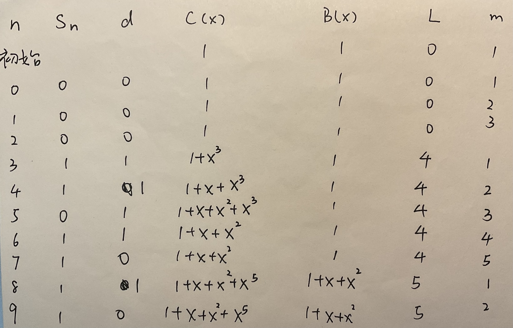

# 数字签名

- 可信
- 不可伪造
- 不可复制
- 不可改变
- 不可抵赖

## 基于公钥密码的数字签名

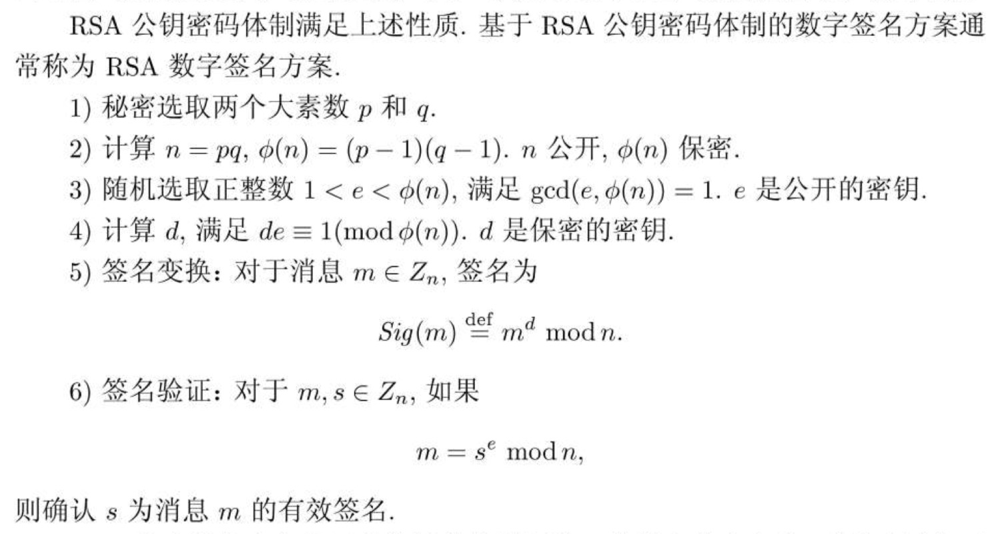

## EIGamal 签名方案

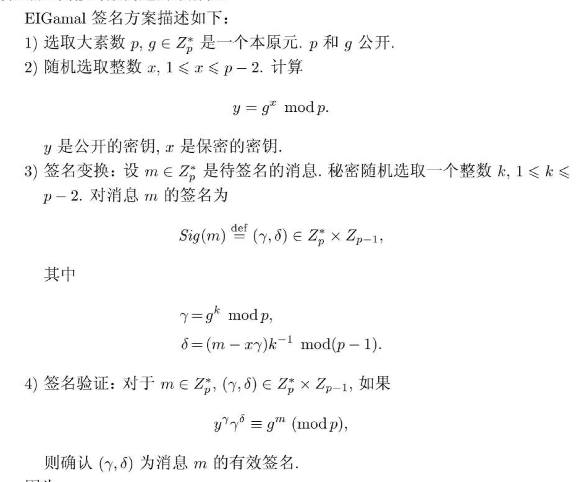

# Hash 函数

## Hash 函数的性质

 给定一个消息 x，如果寻找另一个不同的消息 x’，使得 $H(x) = H(x’)$ 是计算上不可行的，则称 H 关于消息 x 是**弱无碰撞**的。

如果寻找两个不同的消息 x 和 x’ ，使得 $H(x)=H(x’)$ 是计算上不可行的，则称 H 是**强无碰撞**的。

如果对于任意给定的 z，寻找满足 $H(x) = z$ 的消息 x 是计算上不可行的，则称 H 是**单向**的。

## 基于分组密码的 Hash 函数

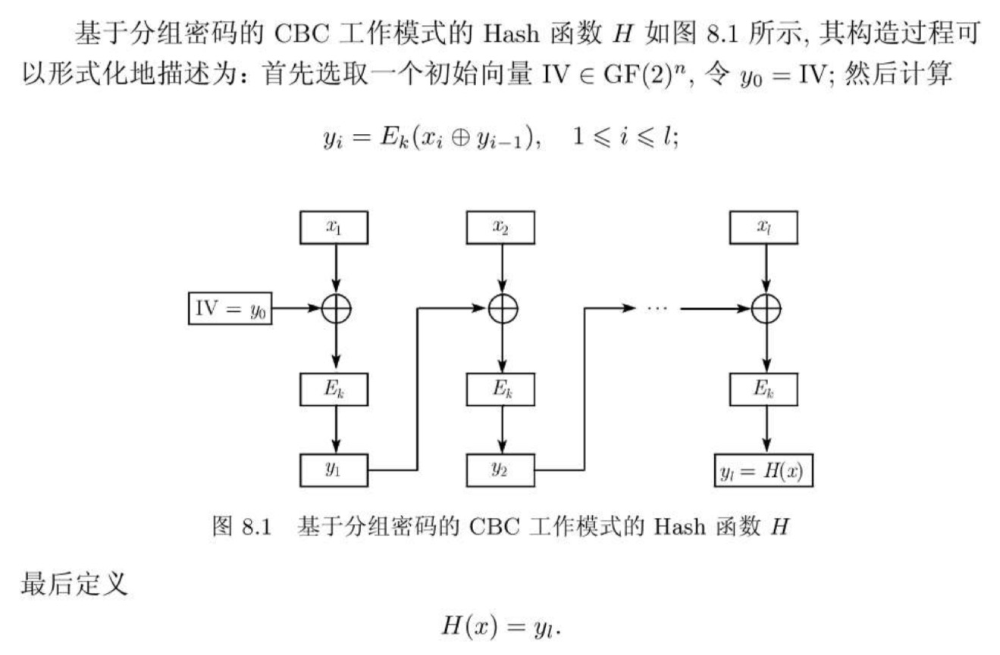

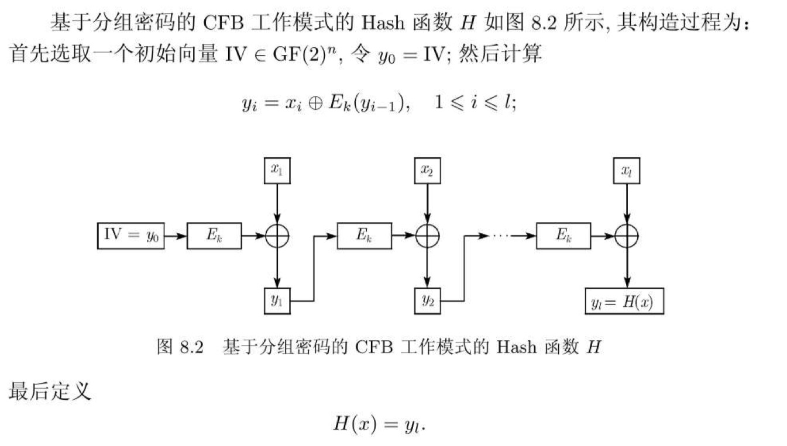

# 密码协议

## 密钥分配与密钥协商

## 密钥分配

Kerboros 密钥分配协议

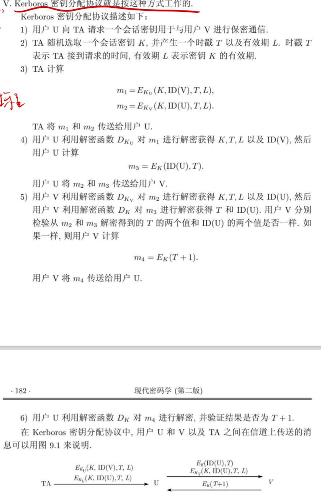

### 密钥协商

Differ-Hellman 密钥交换协议

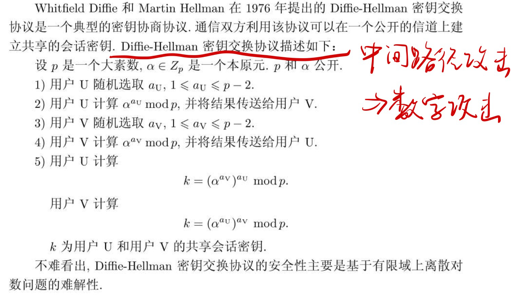

端到端协议可以抵御中间入侵攻击

## 秘密分享

$t \le w$。一个 (t, w) 方案是在 w 个参与者中分享一个密钥 k 的方法，使得任意 t 个参与者在给出他们的秘密份额后可以恢复密钥 k，而任意 t - 1 个参与者无法恢复。

利用 Lagrange 插值公式重建 (t, w)  门限方案中的密钥

令
$$
b_j = \prod_{1 \le m \le t,\; m \ne j} \frac{x_{i_m}}{x_{i_m} - x_{i_j}}
$$
则
$$
k = \sum_{j=1}^{t} b_jy_{i_j} 
$$
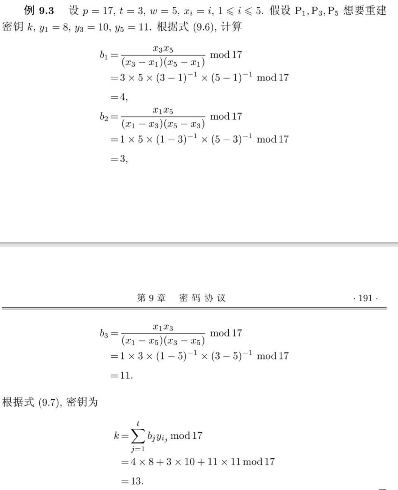

## 零知识证明

P 设法在不泄露秘密信息的同时使 V 相信自己掌握秘密信息
