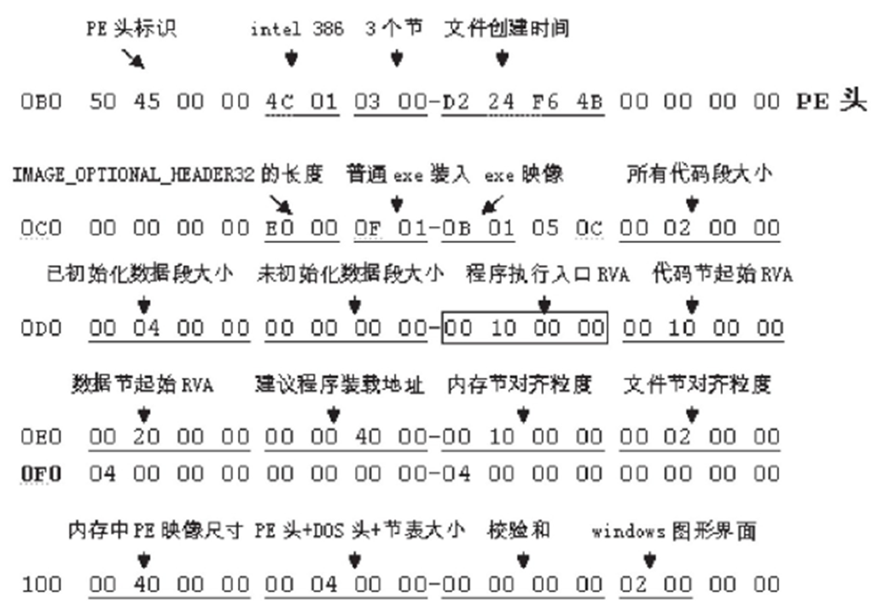

# 软件逆向复习
## IA-32结构 
### 基本结构
  
**中央处理器**（CPU,Central Processor Unit）是进行所有计算和逻辑操作的地方，它包含了数量有限的称为寄存器（register）的存储单元，一个高频时钟（clock）、一个控制单元（CU ,Control Unit）和一个算术逻辑单元（ALU,Arithmetic Logic Unit）。
- **时钟**用于CPU的内部操作和其他系统部件的同步。
- **控制单元**（CU）系统调执行机器指令各个步骤的次序。
- **算术逻辑单元**（ALU）执行加法和减法等算术运算，以及AND，OR和NOT等逻辑运算。

**内存存储单元**是计算机程序运行时存放指令和数据的地方。内存存储单元接受CPU的数据请求，从随机访问存储器（RAM）中取出数据送至CPU,或把数据从CPU送回寄存器中。

**总线**（BUS）是一组用于在计算机各部分之间传送数据的并行线。计算机的总线一般分为三组独立的总线构成：数据总线、控制总线和地址总线。
- **数据总线**（data bus）在CPU和内存之间传送指令和数据；
- **控制总线**（control bus）使用二进制信号同步连接到系统总线上的所有设备的动作；
- 如果当前被执行的指令要在CPU和内存之间传输数据，那么**地址总线**上保持着指令和数据的地址。

### 内存读周期

1. 周期 1∶ 内存操作数的地址位被放到地址总线（ADDR）上。
2. 周期 2∶ 读取线（RD）设为低（0 ），以通知存储器要读一个值。
3. 周期 3∶ CPU等待一个周期，给存储器一些时间以做出响应。在这个时钟周期内，内存控制器把数据放在数据总线（DATA）上。
4. 周期 4∶ 读取线（RD）变为 1，通知 CPU在数据总线（DATA）上读取数据。

### 通用寄存器
| 31-16 | 15-8 | 7-0 | 16-bit | 32-bit | 作用 |
|:---:|:---:|:---:|:---:|:---:|:---|
|  | AH | AL | AX | EAX | (针对操作数和结果数据的)**累加器**，另外还多用于函数返回值中，用于保存返回值 |
|  | BH | BL | BX | EBX | (DS段中的数据指针)**基址寄存器**，查表和间接寻址时存放基址 |
|  | CH | CL | CX | ECX | （字符串和循环操作的）**计数器**，如在循环命令LOOP中，ecx用来循环计数，每执行一次loop，ecx减1 |
|  | DH | DL | DX | EDX | （I/O指针）**数据寄存器**乘除运算、I/O指令中特指端口地址 |
|  |  |  | SI | ESI | （字符串操作源指针）**源变址寄存器** |
|  |  |  | DI | EDI | （字符串操作目标指针）**目的变址寄存器**，EDI和ESI多与特定指令，如LODS/STOS/REP/MOVS等一起使用，主要用于内存的复制。 |
|  |  |  | SP | ESP | （SS段中栈指针）**堆栈指针寄存器/栈顶指针**，指示栈区域的栈顶偏移地址，PUSH/POP/CALL/RET等指令可以直接用来操作ESP。ESP不能再用于其他目的 |
|  |  |  | BP | EBP | （SS段中栈内数据指针）扩展基址指针寄存器，表示**栈区域的基地址/栈底指针**，在函数被调用时保存ESP的值，函数返回时再把值重新返回给ESP，保证栈不会崩溃，这称为栈帧技术 |


---
## x86 32位汇编语言
### 汇编指令
#### 数据传送指令
- **MOV**   **XCHG**
    - 两个操作数不能同时为内存操作数，可以使用寄存器作为中介
    - MOVZX(move with zero-extend)：将该值零扩展至16或32位
    - MOVSX(move with sign-extend)：将该值符号扩展至16或32位

- **PUSH**   **POP**
- **LEA**
    ``` nasm
    buffer db 100 dp(0)
    ; 把字节变量buffer的EA传送给EBX
    lea ebx, buffer
    mov ebx, offset buffer
    lea ebx, [buffer + 50]
    mov ebx, offser [buffer + 50]   ; 错误用法
#### 算数运算指令
| 数据类型 | 缩写    | 大小（字节） | 描述            |
|:----:|:-----:|:------:|:-------------:|
| 字节   | BYTE  | 1      | 8位无符号或有符号数据   |
| 字    | WORD  | 2      | 16位无符号或有符号数据  |
| 双字   | DWORD | 4      | 32位无符号或有符号数据  |

##### 指令
- ADD、ADC(带进位的加法指令)、INC(将操作数的值加1)
- SUB、SBB(带借位的减法指令)、DEC(将操作数的值减1)
- MUL、IMUL(有符号整数乘法)

| 被乘数 | 乘数 | 乘积存放位置 | 备注 |
|:---:|:---:|:---:|:---|
| AL | reg8/mem8 | AX | MUL操作数是8位寄存器，自动将AL当作被乘数。结果存放AX。 |
| AX | reg16/mem16 | DX:AX | MUL操作数是16位寄存器，自动将AX当作被乘数。结果的低位放在AX，高位在DX。 |
| EAX | reg16/mem32 | EDX:EAX | MUL操作数是32位寄存器，自动将EAX当作被乘数。结果的低位在EAX，高位在EDX。 |

- DIV、IDIV (有符号整数除法)

| 被除数 | 除数 | 商 | 余数 |
|:---:|:---:|:---:|:---:|
| AX | reg/mem8 | AL | AH |
| DX:AX | reg/mem16 | AX | DX |
| EDX:EAX | reg/mem32 | EAX | EDX |

##### 算数运算影响的标志
- 零标志和符号标志
    - 目标操作数被赋以零值时，零标志ZF置１
    - 算术运算结果为负时，符号标志SF置１
- 进位标志（无符号算术运算）
    - 无符号算术运算结果对目的操作数而言无法容纳时，进位标志CF置１
- 溢出标志（有符号算术运算）
    - 当算术运算产生的有符号的结果无法容纳于目的操作数时，溢出标志OF置１

~~~nasm
; x、y、z 均为双精度数，分别存放在地址为X, X+2；Y, Y+2；Z, Z+2的存储单元中，
; 用指令序列实现w ←  x + y + 24 - z ，并用W, W+2单元存放w

; 16位寄存器：
  MOV  AX,  [X]
  MOV  DX,  [X+2]
  ADD  AX,  [Y]
  ADC  DX,  [Y+2]       ;  x+y
  ADD  AX,  24
  ADC  DX,  0           ;  x+y+24
  SUB  AX,  [Z]
  SBB  DX,  [Z+2]       ;  x+y+24-z
  MOV  W,   AX
  MOV  W+2, DX          ;  结果存入W, W+2单元
; 32位寄存器：
  MOV  EAX,  [X]
  ADD  EAX,  [Y]        ;  x+y
  ADD  EAX,  24         ;  x+y+24
  SUB  EAX,  [Z]        ;  x+y+24-z
  MOV  [W],   EAX       ;  结果存入W, W+2单元
~~~
 
#### 位操作指令
- AND、OR、XOR
    - 对CF、OF标志清零，不影响AF标志，按运算结果设置其他标志
- SHL、SHR
    - 逻辑左右移，空出位补0
- SAL、SAR
    - SAL算数左移，右边补0
    - SAR算数右移，左边补原来符号位
- ROL、ROR
    - 循环左右移

#### 转移指令
- CMP
    - CMP指令将目的操作数减去源操作数，按照定义相应设置状态标志
    - CMP指令执行的功能与SUB指令相似，但结果不回送目的操作数
- JMP
    - 无条件跳转指令
- 条件转移指令
    - 
    - 无符号数的大小用高（Above）低（Below）表示，利用CF确定高低、利用ZF标志确定相等（Equal）
    - 两数的高低分成4种关系：
        - 低于（不高于等于）：JB(JNAE)
        - 不低于（高于等于）：JNB(JAE)
        - 低于等于（不高于）：JBE(JNA)
        - 不低于等于（高于）：JNBE(JA)

    - 有符号数的大（Greater）小（Less）需要组合OF、SF标志，并利用ZF标志确定相等（Equal）
    - 两数的大小分成4种关系：
        - 小于（不大于等于）：JL(JNGE)
        - 不小于（大于等于）：JNL(JGE)
        - 小于等于（不大于）：JLE(JNG)
        - 不小于等于（大于）：JNLE(JG)
    
#### 循环指令
- LOOP
~~~c
// 数组求和
int array[] = {2, 4, 6, 8, 10};
main() {
    int i, sum = 0;
    for(i = 0; i < sizeof(array) / sizeof(int); i++){
        sum += array[i];
    }
}
~~~
~~~nasm
.data
array dw 2, 4, 6, 8, 10
.code
main proc
    mov edi, offset array
    mov ecx, lengthof array
    mov ax, 0
Again:
    add ax,  [edi]
    add edi, TYPE array
    loop Again
ret
main endp
end main
~~~
~~~nasm
; 假设从变量buff开始存放了若干个字，编写程序统计出其正数、0和负数的个数，并把它们分别存入N1、N2和N3中。 

.386
.model flat, stdcall
option casemap:none

.data
buff	dw	2130, -43, 31, -321, -1234, 345, 0, 3213, 0, 5477 
N1		dw	0
N2		dw	0
N3		dw	0

.code
main proc
        lea esi, buff
        mov ecx, lengthof buff
again:
        cmp word ptr [esi], 0
        jl	lower
        je	equal
        inc	N1
        jmp	loop1
lower:
        inc	N3
        jmp	loop1
equal:
        inc	N2
loop1:
        add esi, TYPE buff
        loop   again
        ret
main endp
        end main
~~~

### 过程
#### 堆栈段
**堆栈帧**（stack frame）是一块堆栈保留区域，用于存放被传递的实际参数、子程序的返回值、局部变量以及被保存的寄存器。
- 被传递的实际参数。如果有，则压入堆栈。
- 当子程序被调用时，使该子程序的返回值压入堆栈。
- 子程序开始执行时，EBP被压入堆栈。
- 设置EBP等于ESP。从这时开始，EBP就变成了该子程序所有参数的引用基址。
- 如果有局部变量，修改ESP以便在堆栈中为这些变量预留空间。

~~~nasm
; 假设执行函数前堆栈指针ESP为NN
push   p2    ;参数2入栈, ESP -= 4h , ESP = NN - 4h
push   p1    ;参数1入栈, ESP -= 4h , ESP = NN - 8h
call test    ;压入返回地址 ESP -= 4h, ESP = NN - 0Ch  
;//进入函数内
{
    push   ebp             ;保护先前EBP指针， EBP入栈， ESP-=4h, ESP = NN-10h
    mov    ebp, esp                   ;设置EBP指针指向栈顶 NN-10h
    mov    eax, dword ptr  [ebp+0ch]  ;ebp+0ch为NN-4h,即参数2的位置
    mov    ebx, dword ptr  [ebp+08h]  ;ebp+08h为NN-8h,即参数1的位置
    sub    esp, 8                     ;局部变量所占空间ESP-=8, ESP = NN-18h
    ...
    add    esp, 8                     ;释放局部变量, ESP+=8, ESP = NN-10h
    pop    ebp                        ;出栈,恢复EBP, ESP+=4, ESP = NN-0Ch
    ret    8                          ;ret返回,弹出返回地址,ESP+=4,ESP=NN-08h, 
                                      ;为平衡堆栈,ESP+=8,ESP=NN,恢复进入函数前的堆栈
} 
~~~

~~~nasm
; 倒转字符串，存入原来的位置
.data
aName BYTE "Abraham Lincoln",0 
nameSize =($ -aName)-1 
.code 
main PROC 
    mov ecx,nameSize        ; 将名字压入堆栈
    mov esi,0               ; 获取字符
L1:
    movzx eax,aName[esi]
    push eax                ; 压入堆栈
    inc esi 
    loop L1                 ; 将名字按逆序弹出堆栈，并存入aName数组
    mov ecx, nameSize 
    mov esi,0 
L2:	
    pop eax                 ; 获取字符
    mov aName[esi], al      ; 存入字符串
    inc esi
    loop L2
    INVOKE ExitProcess,0 
ret
main ENDP 
    END main
~~~

#### 传参方式
##### 寄存器传参
- 调用过程前，将参数传入寄存器；
- call   过程名;
- 这条指令执行后，就立即执行过程的第一条指令。
~~~nasm
; ~~~~~~~~~~~~~~~~~~~~~~~~~~~~~~~~~~~~
; ArraySum

; 计算32位整数数组元素之和
; 接收：ESI=数组偏移量
;      ECX=数组元素的个数
; 返回：EAX=数组元素之和

.data
    array DWORD 1000h, 2000h, 3000h, 4000h, 5000h
    theSum DWORD ?

.code
ArraySum PROC
    push esi
    push ecx
    mov eax, 0

L1:    add eax, [esi]
    add esi, TYPE DWORD
    loop L1

    pop ecx
    pop esi
    ret
ArraySum ENDP

main PROC
    mov esi, OFFSET array
    mov ecx LENGTHOF array
    call ArraySum
    mov theSum, eax

    INVOKE ExiteProcess, 0
main ENDP
END main
~~~

#### 传递实参值
- 假定要传递n个32位的实参值，在call指令前先将实参值逐个压入堆栈，最后写出call指令。 
- 常数、寄存器、变量实参直接利用压栈指令将实参值压入堆栈。

#### 传递实参地址
- 如果要在过程里修改实参，就必须向过程传递实参的地址，过程里用实参的地址访问实参。
- 实参是除静态变量外的其他内存寻址方式，要用两条指令传递它的地址：
    ~~~nasm
    lea EAX，内存寻址方式 
    push EAX
    ~~~	
- 向堆栈复制地址和复制数据的操作是一模一样的。 

### 局部变量


----------
## C语言逆向
### 分支结构
#### if-else
~~~c
if(x > y) x = x + 1;
else x = x - 1; 
~~~


#### if-else if
~~~c
if(x > 5 && x < 10) x = x + 1;
else if(x > 10 && x < 20) x = x + 2; 
else if(x > 20 && x < 30) x = x + 3; 
else if(x > 30 && x < 40) x = x + 4; 
else x = x + 5;
~~~


#### switch-case
转换为地址表，将选择的序号值给了eax，根据eax，jmp到off_410B32 table中的某个地址。


### 循环结构
#### for
~~~c
for(x = 1; x < 20; x++){
    y = y + x;
    ArrayA[x] = y;
}
~~~


---------------------

## PE结构分析
[PE文件结构详解](https://blog.csdn.net/freeking101/article/details/102752048)
### PE文件格式

#### PE文件的层次结构
- DOS MZ header
- DOS stub
- PE header
- section table
- section 1
- section 2
- section ...
- section n


#### RVA与VA
##### RVA
- **相对虚地址**（Relative Virtual Address，RVA）是相对于PE文件映射到内存的基地址的偏移量。
- PE文件格式中用RVA在不知道基地址的情况下表示一个内存地址，它需要加上基地址才能得到线形地址： `VA = RVA + ImageBase`
- 假设某PE文件在进程空间的基地址为：0x00400000，而模块2中的某个位置距离PE文件开始400h，那么该位置的RVA值为0x0000400，VA为0x00400400。
##### VA
- **虚地址**(Virtual Address, VA)
- PE文件加载到内存后，给每个进程分配了独立的4GB虚拟空间，即00000000h～0ffffffffh；
- 进程中每个地址为虚地址；

#### PE头
##### Signature
PE文件标志：PE00
##### File-Header
| 偏移 | 大小 | 名称 | 描述 |
|:---:|:---:|:---:|:---|
| 0 | 2 | Machine | 该文件运行所要求的CPU。更改此域的值后文件可能就不能正常运行。 |
| 0x2 | 2 | NumberOfSections | 文件的节数目。如果我们要在文件中增加或删除一个节，就需要修改这个值 |
| 0x4 | 4 | TimeDateStamp | 文件创建日期和时间 |
| 0x8 | 4 | PointerToSymbolTable | 用于调试，通常为0 |
| 0xC | 4 | PointerToSymbolTable | 用于调试，通常为0 |
| 0x10 | 2 | SizeOfOptionalHeader | OptionalHeader结构大小，必须为有效值。 |
| 0x12 | 2 | Characteristics | 关于文件信息的标记。比如文件是exe还是dll。 |
##### Optional-Header
~~~c
typedef struct _IMAGE_OPTIONAL_HEADER {
        WORD    Magic;                      // 魔数 32位为0x10B，64位为0x20B，ROM镜像为0x107
        BYTE    MajorLinkerVersion;         // 链接器的主版本号 -> 05
        BYTE    MinorLinkerVersion;         // 链接器的次版本号 -> 0C
        DWORD   SizeOfCode;                 // 代码节大小，一般放在“.text”节里，必须是FileAlignment的整数倍 -> 40 00 04 00
        DWORD   SizeOfInitializedData;      // 已初始化数大小，一般放在“.data”节里，必须是FileAlignment的整数倍 -> 40 00 0A 00
        DWORD   SizeOfUninitializedData;    // 未初始化数大小，一般放在“.bss”节里，必须是FileAlignment的整数倍 -> 00 00 00 00
        DWORD   AddressOfEntryPoint;        // 指出程序最先执行的代码起始地址(RVA) -> 00 00 10 00
        DWORD   BaseOfCode;                 // 代码基址，当镜像被加载进内存时代码节的开头RVA。必须是SectionAlignment的整数倍 -> 40 00 10 00
 
        DWORD   BaseOfData;                 // 数据基址，当镜像被加载进内存时数据节的开头RVA。必须是SectionAlignment的整数倍 -> 40 00 20 00
                                            // 在64位文件中此处被并入紧随其后的ImageBase中。
 
        DWORD   ImageBase;                  // 当加载进内存时，镜像的第1个字节的首选地址。
                                            // WindowEXE默认ImageBase值为00400000，DLL文件的ImageBase值为10000000，也可以指定其他值。
                                            // 执行PE文件时，PE装载器先创建进程，再将文件载入内存，
                                            // 然后把EIP寄存器的值设置为ImageBase+AddressOfEntryPoint
 
                                            // PE文件的Body部分被划分成若干节段，这些节段储存着不同类别的数据。
        DWORD   SectionAlignment;           // SectionAlignment指定了节段在内存中的最小单位， -> 00 00 10 00
        DWORD   FileAlignment;              // FileAlignment指定了节段在磁盘文件中的最小单位，-> 00 00 02 00
                                            // SectionAlignment必须大于或者等于FileAlignment
 
        WORD    MajorOperatingSystemVersion;// 主系统的主版本号 -> 00 04
        WORD    MinorOperatingSystemVersion;// 主系统的次版本号 -> 00 00
        WORD    MajorImageVersion;          // 镜像的主版本号 -> 00 00
        WORD    MinorImageVersion;          // 镜像的次版本号 -> 00 00
        WORD    MajorSubsystemVersion;      // 子系统的主版本号 -> 00 04
        WORD    MinorSubsystemVersion;      // 子系统的次版本号 -> 00 00
        DWORD   Win32VersionValue;          // 保留，必须为0 -> 00 00 00 00
 
        DWORD   SizeOfImage;                // 当镜像被加载进内存时的大小，包括所有的文件头。向上舍入为SectionAlignment的倍数。
                                            // 一般文件大小与加载到内存中的大小是不同的。 -> 00 00 50 00
 
        DWORD   SizeOfHeaders;              // 所有头的总大小，向上舍入为FileAlignment的倍数。
                                            // 可以以此值作为PE文件第一节的文件偏移量。-> 00 00 04 00
 
        DWORD   CheckSum;                   // 镜像文件的校验和 -> 00 00 B4 99
 
        WORD    Subsystem;                  // 运行此镜像所需的子系统 -> 00 02 -> 窗口应用程序
                                            // 用来区分系统驱动文件（*.sys)与普通可执行文件（*.exe，*.dll）
 
        WORD    DllCharacteristics;         // DLL标识 -> 00 00
        DWORD   SizeOfStackReserve;         // 最大栈大小。CPU的堆栈。默认是1MB。-> 00 10 00 00
        DWORD   SizeOfStackCommit;          // 初始提交的堆栈大小。默认是4KB -> 00 00 10 00
        DWORD   SizeOfHeapReserve;          // 最大堆大小。编译器分配的。默认是1MB ->00 10 00 00
        DWORD   SizeOfHeapCommit;           // 初始提交的局部堆空间大小。默认是4K ->00 00 10 00
        DWORD   LoaderFlags;                // 保留，必须为0 -> 00 00 00 00
 
        DWORD   NumberOfRvaAndSizes;        // 指定DataDirectory的数组个数，由于以前发行的Windows NT的原因，它只能为16。 -> 00 00 00 10
        IMAGE_DATA_DIRECTORY DataDirectory[IMAGE_NUMBEROF_DIRECTORY_ENTRIES]; // 数据目录数组。详见下文。在PE头偏移78h的位置
    } IMAGE_OPTIONAL_HEADER32, *PIMAGE_OPTIONAL_HEADER32;
 
typedef struct _IMAGE_DATA_DIRECTORY {  
    DWORD   VirtualAddress;  
    DWORD   Size;  
} IMAGE_DATA_DIRECTORY, *PIMAGE_DATA_DIRECTORY;
~~~

- **SizeOfCode**：可执行代码的长度，是所有代码加起来的尺寸
- **AddressOfEntryPonit**：程序开始执行的地方，是一个RVA，指向代码节中的一个位置。若要改变整个执行流程，可将该值指向新的RVA。
- **SectionAlignment**：内存节对齐的粒度。
- **FileAlignment**：文件中节对齐粒度。
- **SizeOfImage**：内存中整个PE映像体的尺寸，是所有头和节经过对齐处理后的大小。
- **SizeOfHeaders**：所有头加节表的大小，等于文件尺寸减去文件中所有节的尺寸，可以以此值作为PE文件第一节的文件偏移量。
- **CheckSum**：校验和，仅用于驱动程序中，在可执行程序中一般为0。
- **Subsystem**：可执行文件的子系统，对于大多数Win32程序，只有两类值：Windows GUI和Windows CUI。这也是病毒判断是否感染的依据之一。
- **DataDirectory**：数据目录表，是一个IMAGE_DATA_DIRECTORY结构数组，每个结构给出一个重要数据结构的RVA。



#### PE数据区
##### 节表
- 作用
    - 描述PE文件各个节的位置、大小、属性。
    - 可以将PE文件想象成为一个逻辑盘，节表是根目录，节就是各种文件。
- 大小
    - 节表项数由由映像文件头结构**IMAGE_FILE_HEADER**中**NumberOfSections**域的值来决定。
    - 每个节表项为**28H**字节。
    - 是紧挨NT映像头的一个结构数组。

| 偏移  | 大小  | 节表项                  | 描述          |
|:----:|:---:|:--------------------:|:-----------:|
| 0    | 0x8 | Name                 | 8个字节的节区名称   |
| 0x8  | 0x4 | VirtualSize          | 节区的尺寸       |
| 0xC  | 0x4 | VirtualAddress       | 节区的RVA地址    |
| 0x10 | 0x4 | SizeOfRawData        | 在文件对齐后的尺寸   |
| 0x14 | 0x4 | PointerToRawData     | 在文件中的偏移     |
| 0x18 | 0x4 | PointerToRelocations | 在OBJ文件中的使用  |
| 0x1C | 0x4 | PointerToLinenumbers | 行号表的位置（调试用） |
| 0x20 | 0x2 | PointerToRelocations | 在OBJ文件中的使用  |
| 0x22 | 0x2 | NumberOfLinenumbers  | 行号表中行号的数量   |
| 0x24 | 0x4 | Characteristics      | 节的属性        |

要通过某节的RVA确定文件偏移，先根据节表计算该RVA所属节，再查找该节的VirtualAddress和PointerToRawData，利用公式`Offset = RVA - VirtualAddress + PointerToRawData`得到offset。
节的范围：`VirtualAddress ~ VirtualAddress + VirtualSize - 1`


##### 节
- PE文件的内容划分成块，称之为**节**（Section），是PE文件存放代码或者数据的基本单元。
- 每个节是一块拥有共同属性的数据和访问权限，如代码节一般不允许用户进行修改。
- 一个典型的PE程序可以具有9个节： .text  .bss  .rdata  .rsrc  .edata  .idata  .pdata  .debug。

##### 对齐

###### 文件对齐
- 磁盘以扇区为单位读写，通常为200h，为了提高文件读取效率，PE文件在构建时以200h为单位对齐
- 若某PE文件某节长度是423h，则该文件需要占用3个对齐单位
###### 内存对齐
- 为了提高内存管理效率，PE文件在加载到进程空间后以页单位对齐
- 由于Windows操作系统对内存属性的设置以页为单位，所以通常情况下，节在内存中的对齐单位必须至少是一个页的大小
- 对32位系统来说，这个值是4KB（1000h），而对于64位操作系统来说，这个值就是8KB（2000h）
- 某节内容为1234h，则需要占用2页

##### 导出表
- 导出表列举了本文件向其他程序提供的可调用函数列表，通常出现在DLL中，EXE文件中也可以有，但通常很少用。
- 导出表由IMAGE_EXPORT_DIRECTORY结构定义。

| 偏移   | 大小 | 导出表项                  | 描述            |
|:----:|:---:|:---------------------:|:-------------|
| 0    | 4  | Characteristics       | 标志，未用         |
| 0x4  | 4  | TimeDateStamp         | 时间戳           |
| 0x8  | 2  | MajorVersion          | 未用            |
| 0xA  | 2  | MinorVersion          | 未用            |
| 0xC  | 4  | Name                  | 指向该导出表的文件名字符串 |
| 0x10 | 4  | Base                  | 导出函数的起始序号     |
| 0x14 | 4  | NumberOfFunctions     | 所有导出函数个数      |
| 0x18 | 4  | NumberOfNames         | 以函数名导出的函数个数   |
| 0x1C | 4  | AddressOfFunctions    | 导出函数地址表RVA    |
| 0x20 | 4  | AddressOfNames        | 函数名称地址表RVA    |
| 0x24 | 4  | AddressOfNameOrdinals | 指向包含AddressOfNames数组中关联函数序数的16位数组       |

- 已知导出函数名，获取函数地址的步骤：
    1. 定位到PE Header
    2. 从数据目录表读取导出表的RVA
    3. 定位导出表获取名字数（NumberOfNames）
    4. 并行遍历AddressOfNames和AddressOfNamesOrdinals指向的数组匹配名字，如果在AddressOfNames指向的数组中找到匹配的名字，从AddressOfNamesOrdinals指向的数组中提取索引值。
    5. 通过提取的索引值在AddressOfFunctions指向的数组中查找对于函数的RVA。

- 已知函数的序数，获取函数地址的一般步骤：
    1. 定位到PE Header
    2. 从数据目录表读取导出表的RVA
    3. 定位导出表取Base值
    4. 减掉Base值得到指向AddressOfFunctions数组的索引
    5. 将该值与NumberOfFunctions作比较，大于等于后者则序数无效
    6. 通过上面的索引就可以获取AddressOfFunctions数组中的RVA。

##### 导入表
- 导入表包含了从其它DLL中导入的函数。
- 该表由成员为IMAGE_IMPORT_DESCRIPTOR结构的结构数组组成。
- 每个IMAGE_IMPORT_DESCRIPTOR结构包含PE文件导入函数的一个相关DLL的信息。
~~~c
typedef struct _IMAGE_IMPORT_DESCRIPTOR {
    union {
        DWORD   Characteristics;            
        DWORD   OriginalFirstThunk;         // 桥1，是一个IMAGE_THUNK_DATA结构数组的RVA，
                                            // 该RVA在文件中与FirstThunk域中指针指向相同，
                                            // 但在内存中不一样
                                            // 指向一个函数名地址串，可能有多个地址，每个
                                            // 地址指向一个函数名
    } DUMMYUNIONNAME;
    DWORD   TimeDateStamp;                  // 时间戳
    DWORD   ForwarderChain;                 // 链表的前一个结构，在程序引用一个DLL的API，
                                            // 并且这个API又引用另一个DLL的API时使用
    DWORD   Name;                           // 指向链接库名字的指针
    DWORD   FirstThunk;                     // 桥2，是一个IMAGE_THUNK_DATA结构数组的RVA
                                            // 加载前和OriginalFirstThunk一样指向一个函数
                                            // 名地址串，加载后变成指向函数位置的地址串
} IMAGE_IMPORT_DESCRIPTOR;
typedef IMAGE_IMPORT_DESCRIPTOR UNALIGNED *PIMAGE_IMPORT_DESCRIPTOR;
~~~
- 加载前
    
    
- 加载后
    
- 通过导入函数节.idata列出某个PE文件的所有导入函数的步骤：
    1. 校验文件是否是有效的PE
    2. 从DOS header定位到PE header
    3. 获取OptionalHeader数据目录表的地址
    4. 转至数据目录表的第二个成员导入目录，提取其VirtualAddress值
    5. 利用VirtualAddress值定位第一个IMAGE_IMPORT_DISCRIPTOR结构
    6. 跳转到IMAGE_IMPORT_DISCRIPTOR并处理

### PE结构变形
#### 结构重叠技术
- 结构重叠技术是指在不影响正常性能的前提下，将某些数据结构进行重叠的技术。在缩小PE的变形中将大量使用这种技术。
- 被覆盖的数据是另一个结构中无用的数据。
- 有用的数据可能只对一个结构起作用，但有时被覆盖的数据在两个结构中都有用。此种情况下发生的重叠必须保证重叠的字段在两个结构中拥有相同值。
- PE加载器并不检测所有的字段。
#### 空间调整技术
- 示例：将某个PE文件的头部增加1页。
- 具体思路是，通过调整字段IMAGE_DOS_HEADER.e_lfanew的值，实现动态地扩充或缩小DOSSTUB块空间，从而达到PE变形的目的。
#### 数据转移技术
- 出于某种考虑，将PE中的一部分数据从常规位置转移到另一个位置。
- 比如，将程序中的变量存储到文件头部结构的某个字段中，将代码转移到头部结构的某个连续空间中等。
- 该技术包括对变量的存储和代码的存储。
#### 数据压缩技术
- 对代码实施压缩，然后在PE头部找一块比较大的连续区域存放解压缩用的代码。
- 加载后将存储的压缩代码通过PE头部的解压缩程序进行解压，解压后即可通过跳转指令实施程序指令的转移。

### PE文件加壳
#### 基础概念
- “壳”就是专门压缩/加密的工具，通过在压缩/加密的过程中加入保护性代码，程序文件会失去原来的程序结构，改变代码的表现形式，增加被篡改和反编译的难度，达到保护程序内部逻辑的效果。
- 加壳：对可执行文件进行压缩/加密的过程
- 脱壳：而对已经加壳后的程序进行解压缩/解密的过程
#### 壳分类
##### 压缩壳
- 以减小软件体积和改变软件可执行代码的特征为目的。
- 压缩壳的主要目的对程序进行压缩，对程序的保护不是该类壳的重点。
- 使用压缩壳可以帮助缩减PE文件的大小，隐藏了PE文件内部代码和资源，便于网络传输和保存。
- 目前兼容性较好的压缩壳主要有ASPack、UPX和PECompact等。
##### 加密壳
- 以保护软件为目的，根据用户输入的密码用相应的加密算法对原程序进行加密。
- 加密壳最主要的功能就是保护程序免受逆向分析，在加壳中运用了多种防止代码逆向分析的技术。
- 加密壳被大量用于对安全性要求高，且对破解敏感的应用程序，同时也会有一些恶意应用通过加密壳来躲避杀毒软件的查杀。
- 目前常用的加密壳主要有ASProtect、Armadillo、EXECryptor以及Themida等。
#### 壳原理
- 加壳程序的运行流程
    - 加壳程序的运行过程中，由于壳修改了原程序的执行文件结构，从而壳代码能比原程序逻辑更早的获得控制权。
    - 加壳程序的运行流程
        1. 保存入口参数
        2. 获取所需要的API地址
        3. 解密原程序的各个区块的数据
        4. 初始化程序的IAT表
        5. 对重定位项进行处理
        6. 跳转到程序的原入口点
- 程序入口
    - 壳程序会先于原程序逻辑获得控制权，因此原程序入口被修改为壳的代码的开始位置；
- 获取所需要的API地址
    - 正常的程序导入表中存放了从外部加载的函数信息， 其中包括DLL名称、函数名称、函数地址等。
    - 为了防止从这些信息猜测出来程序的功能，外壳的导入表中只有GetProcAddress、GetModuleHandle和 LoadLibrary这几个函数。
- 解密原程序的各个区块的数据
    - 加壳过程一般都会对源程序的各个块进行加密，在壳执行完毕后，为了能正确执行源程序的代码，需要对加密后的各个块进行解密。
- 初始化程序的IAT表
    - 壳一般都修改了原程序文件的导入表，为了让源程序正常运行，外壳需要自己模仿Windows系统的工作来填充输入表中相关的数据。
- 跳转到程序的原入口点
    - OEP：(Original Entry Point)，程序的入口点，软件加壳就是隐藏了OEP（或者用了假的OEP），只要找到程序真正的OEP，就可以立刻脱壳。
    - 当程序运行到OEP这个位置，程序控制权会交还给原程序，一般脱壳的步骤需要寻找这个OEP点。

--------------
## .NET
### 基本概念
- 统一了编程语言：无论程序是用C#还是C++编写，程序最终都会被编译为.NET中间语言IL。
- 扩展了PE文件的格式：可执行文件中不再保存机器码，而是保存IL指令和元数据，部分结构也被改变，用于保存.NET的相关信息。
- Windows不再直接负责程序的运行，而是由.NET框架进行管理，框架中的JIT引擎负责在运行时将IL代码即时编译为本地汇编代码后执行。
- .NET特点：扩展了PE文件的格式：可执行文件中不再只保存机器码，而是保存IL指令和元数据。
- **MSIL**：.NET高级语言在编译后都会生成IL。IL是.NET唯一能读懂的语言，也是唯一可执行的语言。
- **CLR**（Common Language Runtime）：CLR是IL语言的运行环境，就像Windows是普通PE程序的运行环境一样。
- **Metadata**： 在.NET中，元数据(Metadata)描述了一个可执行文件的所有信息，包括版本、类型的各个成员(方法、字段、属性、事件)等。
- **Token**：同一程序中区分和定位不同元数据的依据。

### IL执行过程
- IL语言最大的特点是以栈为基础进行操作，通常不直接操作寄存器和内存。
- 有效的IL程序必须保证栈的平衡，若在方法开始时栈为空，则在方法结束时栈也必须为空，这一点与Win32上的栈平衡有点类似。
- 部分IL指令直接对栈进行操作，例如在栈中取操作数或将计算结果压入栈。
- 以跳转指令为例，ASM中的jz指令判断的是CPU的Zero标志位，栈数据对它没有影响；而IL中除了br和br.s(直接跳转),其他以字母b开头的条件跳转均要求将栈顶的1个或2个元素取出并进行比较，指令结束后的栈已经被修改了。在进行跳转指令patch的时候，一定要注意栈的平衡

### 强名称
- 强名称(StrongName)是.NET提供的一种验证机制，主要功能包括标识版本和标识原作者。
- 第1个功能用来弥补Windows中DLL机制的缺陷，因为不同版本的DLL,只要强名称不同，便可在.NET中共存。
- 第2个功能主要用来帮助用户验证自己得到的程序是否为原作者所写且没有被修改(例如添加恶意代码)。
- 强名称的原理和Win32下的自校验有点类似，也是利用特定的算法对程序进行Hash计算，但检验过程由.NET平台实施。
- 在.NET平台诞生时，强名称更多地被当成一种代码保护机制使用——保证自己的程序不被patch。


